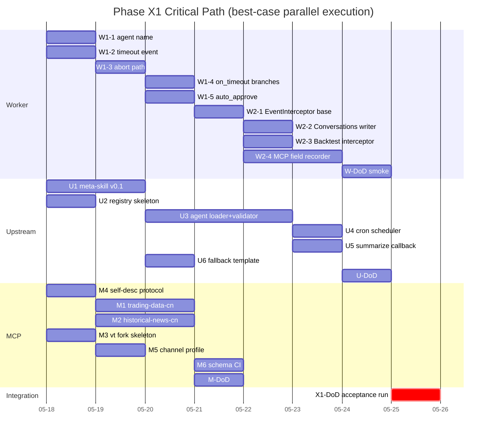

# Workflow: Phase X1 Implementation Backlog

> **Generated**: 2026-05-15
> **Status**: PLAN ONLY — no code executed, no files modified outside this document
> **Sources**:
> - [docs/design/strategy-artifact-and-scheduling.md](../docs/design/strategy-artifact-and-scheduling.md) (v2.10, 5 themes + 16 OQ all closed)
> - [docs/design/follow-up-recommendations.md](../docs/design/follow-up-recommendations.md) (3-lane execution roadmap)
> - [docs/archive/code-review-2026-05-14.md](../docs/archive/code-review-2026-05-14.md) (worker P0/P1 backlog)
> **Next**: After review/approval, use `/sc:implement` per task block to execute

---

## 0. TL;DR

Phase X1 = **MVP end-to-end loop**: a user converses with Prometheus → produces one `ma250-pullback@0.0.1` SKILL bundle → registry stores it → any skill-aware agent loads it → runs once → outputs ≤7 picks + reasons + degradation_report.

Three **parallel lanes** with no hard cross-lane blockers:

| Lane | Owner | Task count | Estimated effort | Critical path? |
|---|---|---:|---:|---|
| W. Worker (本仓库) | this repo | 9 | ~10 days | YES — gates SKILL writeback |
| U. Upstream Runtime | upstream team | 7 | ~8 days | YES — gates loader & scheduler |
| M. MCP / vibe-trading | MCP team | 6 | ~7 days | NO — can lag X1 by 1 sprint |

**Calendar target**: 2~3 weeks to X1 DoD assuming 3 lanes run truly in parallel.

**Out of scope for X1** (locked, do not pull in): multi-tenant, RBAC, Registry HTTP API, MCP Docker images, LLM corrective retry, degradation_report i18n, shared SKILL components. See §11.

---

## 1. Phase X1 Scope & Goal

### 1.1 Goal Statement

> Produce **one strategy SKILL bundle** through the full lifecycle (research → freeze → registry → agent load → daily run → degradation-aware report), proving the architecture invariants hold end-to-end.

### 1.2 Definition of Done (X1)

A **single** acceptance run must satisfy ALL of:

- [ ] User and Prometheus converse for ~30 min, producing `ma250-pullback@0.0.1` SKILL bundle in `LegoNanoBot/strategies/ma250-pullback/0.0.1/`
- [ ] `manifest.json` validates against env_lock validator with **zero failures**
- [ ] `vibe-trading.backtest` runs the bundle and writes results to `backtests/2026-MM-DD-baseline/`
- [ ] `conversations/{ISO8601}-{slug}.jsonl` is written by worker (slug auto-generated)
- [ ] Manual cron scheduler invokes agent loader → produces ≤7 picks with non-empty `reason_text` and `degradation_report` block
- [ ] One **forced** degradation path (e.g., disconnect news MCP) results in a non-empty `degraded_steps[]` and the run still pushes — does not abort silently
- [ ] `INDEX.json` lists `ma250-pullback` with `latest_active_version: "0.0.1"` and `channel: "internal-a-share"`

### 1.3 Architecture Invariants (must not break — see design §11.3)

1. Worker code MUST NOT contain strings `vibe-trading`, `strategy`, `signal_engine`, `ma250` (worker stays business-agnostic)
2. SKILL bundle directory is **immutable** after writeback — version bump = new directory
3. env_lock validator returns ALL failures aggregated (not fail-fast)
4. Production-time runs MUST NOT call back into worker
5. Every degradation MUST surface in `degradation_report` and ride out with the picks payload

---

## 2. Three-Lane Overview

```
┌─────────────────────────────────────────────────────────────────────────────┐
│ Lane W — Worker (this repo)                                                 │
│   W1 P0 fixes (5 tasks) ──┐                                                 │
│   W2 SSE hooks (4 tasks) ─┴─► W-DoD: bundle writeback works end-to-end      │
└─────────────────────────────────────────────────────────────────────────────┘
                                    ║
                             ╔══════╩══════╗
                             ║ Cross-team  ║
                             ║ sync (§10)  ║
                             ╚══════╦══════╝
                                    ║
┌───────────────────────────────────╨─────────────────────────────────────────┐
│ Lane U — Upstream Runtime                                                   │
│   U1 meta-skill v0.1                                                        │
│   U2 Registry skeleton + INDEX.json                                         │
│   U3 Agent Loader + env_lock validator                                      │
│   U4 Cron scheduler skeleton                                                │
│   ─► U-DoD: agent can load + run a SKILL, validator catches missing env    │
└─────────────────────────────────────────────────────────────────────────────┘
                                    ║
┌───────────────────────────────────╨─────────────────────────────────────────┐
│ Lane M — MCP / vibe-trading fork                                            │
│   M1 trading-data-cn repo + tools + schemas/                                │
│   M2 historical-news-cn repo + tools + schemas/                             │
│   M3 vibe-trading-a-share fork skeleton + GOVERNANCE.md                     │
│   M4 MCP self-description protocol (list_tools / describe_tool)             │
│   ─► M-DoD: 3 MCPs publish git-tagged v1.0 with introspectable schemas     │
└─────────────────────────────────────────────────────────────────────────────┘
```

---

## 3. Worker Lane (this repo, `VibeTradingOpenCodeWorker`)

> **Lane invariant**: every task here must keep the worker business-agnostic. The SSE hooks treat their outputs as **opaque artifact subtype `strategy_skill`** — they do NOT parse SKILL.md, do NOT understand vibe-trading, do NOT know what a strategy is.

### 3.1 W1 — P0 Pre-condition Fixes

These five fixes are **blocking** for SSE hooks: the hooks rely on correct terminal events and correct HITL semantics. Run W1 strictly before W2.

#### Task W1-1: Restore agent names `Prometheus` / `Sisyphus`
- **Estimate**: 0.5 day
- **Priority**: P0 (blocker)
- **Depends on**: nothing
- **References**: code-review §P0-5, ADR-001/006, [src/worker/adapters/opencode/driver.py:56-59](../src/worker/adapters/opencode/driver.py#L56-L59)
- **Status**: ✅ DONE (commit `7404b16`, 2026-05-15)
- **Acceptance criteria**:
  - [x] `AGENT_PROMETHEUS = "Prometheus"`, `AGENT_SISYPHUS = "Sisyphus"`
  - [x] Pre-flight verification: container entrypoint logs `GET /agent` response from opencode; assertion confirms `Prometheus` & `Sisyphus` are present (catches missing oh-my)
  - [x] If oh-my NOT loaded, fail container start with explicit error (NOT silent fallback to `plan`/`build`)
  - [x] Unit test: driver constructs payload with `agent: "Prometheus"` for plan_first mode (regression-guard via [tests/unit/test_driver_agent_routing.py](../tests/unit/test_driver_agent_routing.py))
- **Verification gap closer** (per code-review §P0-5 second-look plan): also ship the `oh-my-opencode doctor --json` build-time assertion in `Dockerfile.arm64` — implemented as `find ... -name package.json -path '*oh-my-openagent*'` integrity check ([Dockerfile.arm64:59-67](../docker/worker/Dockerfile.arm64#L59-L67)) since no separate `oh-my-opencode` CLI exists in the image.

#### Task W1-1b: Make opencode actually load oh-my-openagent  *(resolved 2026-05-16)*
- **Estimate**: 0.5 day (investigation) + 0.5 day (fix + verify)
- **Priority**: P0 (Phase X1 is un-runnable until this lands; W1-1 entrypoint gate currently exits rc=5 every container start)
- **Depends on**: W1-1 (this exists because W1-1's verification gate surfaced the bug)
- **References**:
  - Empirical evidence (rebuild 2026-05-16): `opencode 1.15.0` health check passes first, but `oh-my-openagent 4.1.2` is only visible from `/agent` after plugin init finishes
  - Root causes:
    1. [src/worker/orchestrator/orchestrator.py](../src/worker/orchestrator/orchestrator.py#L299-L325) originally emitted `OPENCODE_CONFIG_CONTENT` without any plugin declaration
    2. Container runtime did not materialize `OPENCODE_CONFIG_CONTENT` into `~/.config/opencode/opencode.json`
    3. Entrypoint used a single short `/agent` timeout; actual plugin readiness lagged health by about 12s on arm64
  - Cache extraction also needed to change from package-copy to install-based packaging because `oh-my-openagent 4.1.2` externalizes runtime deps such as `zod`
- **Implemented fix**:
  1. Inject `"plugin": ["oh-my-openagent@latest"]` into `config_content` in `_build_container_env`
  2. Write `OPENCODE_CONFIG_CONTENT` to `~/.config/opencode/opencode.json` during container startup
  3. Poll `/agent` for up to 30s and require `Prometheus` + `Sisyphus` before entrypoint success
  4. Rebuild offline cache tarball with install-based dependency closure for `oh-my-openagent 4.1.2`
- **Verification status**:
  - [x] Container starts without entrypoint failing — arm64 validation shows `/agent` ready after 12s and includes both `Prometheus` and `Sisyphus`
  - [ ] E2E test (`tests/e2e/test_tianqi_e2e.py`) re-run with canonical agent names in this pass
  - [x] Document the plugin loading mechanism in [docs/adr/ADR-006-ohmy-version-and-entry.md](../docs/adr/ADR-006-ohmy-version-and-entry.md)
- **Out of scope**: any rework of W1-1's verification gate — the gate is correct; only the underlying loading mechanism needs fixing

#### Task W1-2: Add `task_timed_out` event kind + dedicated exception
- **Estimate**: 0.5 day
- **Priority**: P0
- **Depends on**: nothing
- **References**: code-review §P0-6, [src/worker/contract/event.py:69-95](../src/worker/contract/event.py#L69-L95), [src/worker/contract/exceptions.py](../src/worker/contract/exceptions.py) (already exists)
- **Acceptance criteria**:
  - [ ] `TaskEventKind.task_timed_out` added; `TERMINAL_EVENT_KINDS` updated
  - [ ] New `TaskTimedOutError` class in `contract/exceptions.py`
  - [ ] Driver translates `asyncio.TimeoutError` → `TaskTimedOutError` (NOT `RuntimeError`)
  - [ ] Queue handler dispatches on exception type → writes `task_timed_out` event + `TaskStatus.timed_out`
  - [ ] Existing `tests/unit/test_terminal_exceptions.py` extended with timeout assertion

#### Task W1-3: HITL abort path writes `task_aborted`
- **Estimate**: 0.5 day
- **Priority**: P0
- **Depends on**: W1-2 (exception dispatch refactor)
- **References**: code-review §P0-7, [src/worker/adapters/opencode/driver.py:243-246](../src/worker/adapters/opencode/driver.py#L243-L246), [src/worker/orchestrator/queue.py:138-148](../src/worker/orchestrator/queue.py#L138-L148)
- **Acceptance criteria**:
  - [ ] Driver raises `TaskAbortedError` (new) on HITL reject/timeout-abort
  - [ ] Queue's exception dispatch maps `TaskAbortedError` → `task_aborted` event + `TaskStatus.aborted`
  - [ ] `_cleanup` annotates abort source (`user_reject` / `hitl_timeout`)
  - [ ] Test in `tests/unit/test_terminal_dispatch.py` covers the three exception classes

#### Task W1-4: Implement HITL `on_timeout` full branches (`continue` / `escalate`)
- **Estimate**: 1 day
- **Priority**: P1 (but X1-blocking because meta-skill author guide assumes full schema works)
- **Depends on**: W1-3
- **References**: code-review §P1-13, [src/worker/adapters/opencode/driver.py:471-486](../src/worker/adapters/opencode/driver.py#L471-L486), [src/worker/contract/task.py](../src/worker/contract/task.py)
- **Acceptance criteria**:
  - [ ] `on_timeout="continue"` → driver auto-approves with `decision=approve, source=auto`, logs `hitl_timeout_continue`
  - [ ] `on_timeout="escalate"` → emits `mode_escalation_suggested` event, then aborts via W1-3 path
  - [ ] `on_timeout="abort"` (existing) unchanged
  - [ ] Schema validation rejects unknown `on_timeout` values at task ingest (not at runtime)
  - [ ] New unit tests cover all three branches

#### Task W1-5: Implement HITL `auto_approve` field
- **Estimate**: 1 day
- **Priority**: P1 (X1-blocking same reason as W1-4)
- **Depends on**: W1-3
- **References**: code-review §P1-14, [src/worker/contract/task.py:278-286](../src/worker/contract/task.py#L278-L286)
- **Acceptance criteria**:
  - [ ] `_handle_permission` first-step matches incoming permission `tool_name + path` against `auto_approve[]` patterns
  - [ ] Match → emit `hitl_auto_approved` event + respond `approve` immediately, no SSE-side prompt to upstream
  - [ ] No-match → existing prompt flow
  - [ ] Pattern syntax documented (glob? regex?) — pick one and stick with it; document in `docs/usage-guide.md`
  - [ ] Unit test covers match + no-match + empty list

**W1 exit gate**: all 5 tasks merged + green CI + `tests/e2e/test_tianqi_e2e.py` re-run unaffected.

---

### 3.2 W2 — Phase 6 SSE Hooks (writeback infrastructure)

These three hooks are the worker's **only** contribution to the strategy SKILL pipeline. They are **business-agnostic** by design — they expose generic mechanisms that the upstream meta-skill orchestrates.

#### Task W2-1: Extract `EventInterceptor` base class
- **Estimate**: 1 day
- **Priority**: P1
- **Depends on**: W1 complete
- **References**: design §5.3 ("三个 hook 共享同一套 SSE 拦截基础设施"), [src/worker/adapters/opencode/driver.py:310-407](../src/worker/adapters/opencode/driver.py#L310-L407)
- **Acceptance criteria**:
  - [ ] New module `src/worker/adapters/opencode/interceptors/base.py` with `EventInterceptor` abstract class
  - [ ] Methods: `on_event(event_dict)`, `on_terminal(task_status)`, `flush() -> Optional[Path]`
  - [ ] Driver `_consume_sse` invokes a registered list of interceptors per event (in addition to existing handling)
  - [ ] Interceptor errors are isolated — one failing interceptor does NOT break SSE stream or other interceptors
  - [ ] Interceptor list is wired in via constructor, defaults to empty for backward compat
  - [ ] Unit tests: interceptor receives every event, errors swallowed + logged, terminal callback fires on each TERMINAL kind

#### Task W2-2: `ConversationsWriter` interceptor
- **Estimate**: 1 day
- **Priority**: P1
- **Depends on**: W2-1
- **References**: design §3.6 + §5.3 + §3.6.0 (slug rule)
- **Acceptance criteria**:
  - [ ] New `interceptors/conversations.py` listening for `assistant_delta`, `tool_call_*`, `decision_received`
  - [ ] On terminal event, assembles message array and writes JSONL to `<artifacts_dir>/<task_id>/conversations/{ISO8601}-{slug}.jsonl`
  - [ ] **Slug source**: emitted as artifact metadata field `conversations_slug` — interceptor either (a) calls a configured `summarize_callback(messages) -> str` provided by the upstream profile or (b) falls back to `untitled-{task_id[:6]}` if no callback. NO direct LLM call inside the worker (keeps business-agnostic).
  - [ ] Slug regex enforced: `^[a-z0-9][a-z0-9-]{2,40}$`; non-conforming → fallback
  - [ ] Sensitive-info scrub hook (regex-based; API key / 18-digit ID number patterns) — see Risk §9 "conversations leakage"
  - [ ] Output appears in `Artifact.metadata.conversations_path`
  - [ ] Unit test with synthetic SSE stream, asserts JSONL well-formed and slug fallback works

#### Task W2-3: `BacktestInterceptor`
- **Estimate**: 1 day
- **Priority**: P1
- **Depends on**: W2-1
- **References**: design §3.6 + §5.3 ("识别 vibe-trading.backtest 调用")
- **Acceptance criteria**:
  - [ ] New `interceptors/backtest.py` matches `tool_call_finished` events where `tool_name` matches a configured `backtest_tool_pattern` (e.g., `*.backtest`) — pattern injected via opencode_profile, NOT hardcoded `vibe-trading`
  - [ ] Extracts source `run_dir` from tool args, copies to `<artifacts_dir>/<task_id>/backtests/{ISO8601}-{label}/`
  - [ ] `label`: defaults to `iter-N` (auto-incremented per task), overridable via tool result metadata `backtest_label`
  - [ ] Idempotent: re-running on same `run_dir` does not double-copy
  - [ ] Output appears in `Artifact.metadata.backtests[]` (list of paths)
  - [ ] Unit test with mocked tool_call event + temp run_dir; asserts copy occurred and label increments

#### Task W2-4: `McpFieldRecorder` interceptor
- **Estimate**: 2 days
- **Priority**: P1
- **Depends on**: W2-1
- **References**: design §5.3 (OQ-9), §3.3 (`required_*_fields`)
- **Acceptance criteria**:
  - [ ] New `interceptors/mcp_fields.py` listens to ALL `tool_call_finished` events
  - [ ] Aggregates per `(mcp_name, tool_name)`:
    - `required_input_fields`: union of top-level keys observed in `args`
    - `required_output_fields`: NOT inferable from worker side — accept upstream-provided hints via tool result metadata `read_fields[]` (Prometheus's "only-read-used-fields" double-check is the source of truth; worker is the secondary recorder)
  - [ ] On terminal, emits a `mcp_field_summary.json` artifact (separate file, NOT the SKILL manifest itself — meta-skill author guide instructs Prometheus on how to merge it into manifest.json)
  - [ ] Pattern for extracting `mcp_name` from tool name: configurable prefix matcher in opencode_profile (default `^([a-z][a-z0-9-]+)\.`)
  - [ ] Unit test with synthetic multi-MCP tool call stream; asserts aggregation correctness and idempotency

**W2 exit gate**: all four interceptors enabled in default opencode profile; existing E2E continues to pass; new artifacts appear in expected paths; ADR-001 still holds (worker has no strategy/vibe-trading-specific code paths).

---

### 3.3 W-DoD — Worker Lane Done

Required for handoff to upstream:

- [x] All W1 + W2 tasks merged
- [x] `/sc:test` (or `pytest`) green; coverage on new interceptors ≥ 80%
- [x] Updated [docs/usage-guide.md](../docs/usage-guide.md) documents `opencode_profile` fields: `summarize_callback` (note: callable-only, requires upstream factory), `backtest_tool_pattern`, `mcp_name_prefix_regex`, `auto_approve` patterns — see "`opencode_profile` 配置" section
- [x] One end-to-end smoke run: [tests/integration/test_w_dod_smoke.py](../tests/integration/test_w_dod_smoke.py) feeds a fixture task with all three interceptors enabled and verifies all expected output files materialize under `<task_id>/conversations/`, `<task_id>/backtests/`, `<task_id>/mcp_field_summary.json`; also verifies DB artifact rows + `artifact_ready` events (2 PASS, completed + aborted terminal paths)
- [ ] No new occurrences of forbidden strings (`vibe-trading|strategy|signal_engine|ma250`) in `src/worker/` (grep gate added to CI) — *purity gate test still green; CI grep gate left as a separate ticket*

---

## 4. Upstream Runtime Lane

> **Lane invariant**: this is where business knowledge lives. The meta-skill, registry schema, and loader are all business-aware. Lives in upstream runtime repo (NOT this worker repo).

### Task U1: Meta-skill `strategy-skill-author` v0.1
- **Estimate**: 2 days
- **Priority**: P0 (gates Prometheus's ability to produce conformant SKILLs)
- **Depends on**: nothing (parallel-startable)
- **References**: design §5.5, follow-up §1.2 P0 "meta-skill 起草"
- **Acceptance criteria**:
  - [ ] New `skills/strategy-skill-author/SKILL.md` in upstream skills repo
  - [ ] Frontmatter: `name`, `description`, `category: meta`, `version: 0.1.0`
  - [ ] Sections cover: required SKILL.md sub-sections (6 of them), frontmatter rules, prompts schema, manifest env_lock filling, references/ recommendations, self-check checklist
  - [ ] Self-check checklist explicitly includes: Offline Quantization Equivalent written + `quality:` declared; channel declared; `required_*_fields` populated; `pick_explanation.md` present with fallback template
  - [ ] Strategy_id naming rule (kebab-case regex `^[a-z][a-z0-9-]{2,40}$`) + LLM duplicate-check against INDEX.json
  - [ ] SemVer rule (MAJOR/MINOR/PATCH semantics from design §3.6.0)
  - [ ] Worked example: a minimal `ma250-pullback@0.0.1` SKILL is included in `examples/`
  - [ ] Injected via `opencode_profile.skills` in worker task ingest

### Task U2: Strategy Registry skeleton
- **Estimate**: 0.5 day
- **Priority**: P0
- **Depends on**: nothing
- **References**: design §6.1 (D16), follow-up §1.2 P0
- **Acceptance criteria**:
  - [ ] Create `LegoNanoBot/strategies/` directory in upstream registry repo (or sub-folder)
  - [ ] Initial `INDEX.json` with `schema_version: "1.0"`, `updated_at`, empty `strategies: {}`
  - [ ] `README.md` documents structure, immutability rule, `latest_active_version` semantics, channel field
  - [ ] One `tests/test_index_schema.py` validating any committed INDEX.json against a JSON Schema (JSON Schema file stored in same repo)
  - [ ] **NOT in scope**: any HTTP API, search, tags, RBAC (Phase 7 per D16)

### Task U3: Agent Loader + env_lock validator
- **Estimate**: 3 days
- **Priority**: P1 (DoD-blocking)
- **Depends on**: U1 (knows meta-skill output shape), M4 (introspection protocol must exist to test against)
- **References**: design §6.2, §6.2.1 (D17 / OQ-7)
- **Acceptance criteria**:
  - [ ] New Python lib `strategy_skill_loader` (importable by Claude Code, opencode-mcp, vibe-trading-mcp)
  - [ ] `load_skill(skill_dir: Path, force_channel_mismatch: bool = False) -> LoadedSkill | LoadFailure`
  - [ ] Validation stages run in order, **never short-circuit**, all failures aggregated:
    1. Channel check
    2. MCP existence + version
    3. MCP schema introspection (calls `describe_tool` per M4)
    4. Required env vars
    5. Required DB connectivity (5s timeout)
  - [ ] On failure: returns structured error per design §6.2.1 spec, including auto-generated `remedy_hint`
  - [ ] On success: returns `LoadedSkill` with handles to skill_md_text, signal_engine module, prompt loaders
  - [ ] `--force-channel-mismatch` flag → warn + audit-log entry; entry includes `skill_id, source_channel, target_channel, forced_by, forced_at`
  - [ ] Unit tests: each stage's failure mode + multi-stage aggregation case + force flag path
  - [ ] Integration test: feed a deliberately broken manifest (missing field, wrong channel, missing env), assert all 5 categories of error surface in single response

### Task U4: Cron scheduler skeleton
- **Estimate**: 1 day
- **Priority**: P1 (DoD-blocking — needed for manual daily run validation)
- **Depends on**: U3
- **References**: design §6.3, follow-up §1.2 P1 "每日 scheduler 雏形"
- **Acceptance criteria**:
  - [ ] Script `run_strategy.py` accepts `--skill <id>`, `--version <ver>` (optional, defaults to INDEX `latest_active_version`), `--date <YYYY-MM-DD>` (defaults to today)
  - [ ] Calls `strategy_skill_loader.load_skill()` → on failure prints structured error and exits 2
  - [ ] On success: invokes loaded skill following SKILL.md "How to Invoke" semantics (this MVP version may hardcode the canonical screen_today flow; full agent-led execution is X2)
  - [ ] Output: writes JSON file `runs/{date}/{skill}@{version}.json` with `picks[]`, `degradation_report{}` (English keys, zh-CN values per OQ-15)
  - [ ] On `degradation_report.aborted_with_report = true` (OQ-16) → still write empty `picks: []` + `ui_emphasis: "high"` + clear console banner
  - [ ] Cron line documented: `00 09 * * 1-5 python run_strategy.py --skill ma250-pullback`
  - [ ] **Not in scope**: real notification channel (email/dingding/wechat) — Phase X2

### Task U5: `summarize_callback` provider
- **Estimate**: 0.5 day
- **Priority**: P2
- **Depends on**: W2-2 (defines the callback contract)
- **References**: design §3.6.0 (conversations slug), W2-2 acceptance criteria
- **Acceptance criteria**:
  - [ ] Tiny upstream-side helper that takes message array → calls cheap LLM → returns 3-4 word kebab-case slug
  - [ ] Hard-cap: 1 LLM call per task terminal, max 200 tokens
  - [ ] Wired into worker task ingest via `opencode_profile`
  - [ ] If LLM fails or returns malformed slug → returns None, worker uses fallback (per W2-2)

### Task U6: `pick_explanation` fallback template registry
- **Estimate**: 0.5 day
- **Priority**: P2
- **Depends on**: U1
- **References**: design §3.5.1 (D12 fallback), §3.3 manifest `fallback_template_path`
- **Acceptance criteria**:
  - [ ] Default `reason_template.md` shipped with meta-skill examples
  - [ ] Template variables: `{symbol}, {name}, {score}, {matched_rules}, {today}` — string interpolation only, NO LLM
  - [ ] Loader resolves manifest's `fallback_template_path` relative to skill dir; if missing, uses meta-skill's default
  - [ ] Unit test: forced LLM failure → template renders + `degradation_report.degraded_steps` includes `pick_explanation`

### Task U7: Per-tenant LLM cost ledger (skeleton)
- **Estimate**: 1 day
- **Priority**: P2 (NOT a hard X1 blocker, but needed before any X2 multi-user push)
- **Depends on**: nothing
- **References**: design §3.3 manifest comment block on OQ-13
- **Acceptance criteria**:
  - [ ] Single-tenant placeholder for X1: ledger lives in JSON file `runtime/cost_ledger.json`, append-only
  - [ ] Each LLM call records `{tenant: "default", model, prompt_tokens, completion_tokens, cost_usd, ts}`
  - [ ] `--budget-check` CLI on `run_strategy.py` reads month-to-date sum, prints if > 80% of monthly cap (cap configured in env `MONTHLY_LLM_BUDGET_USD`, default 50)
  - [ ] No enforcement in X1 (just visibility); enforcement is X2

### U-DoD — Upstream Lane Done
- [ ] U1, U2, U3, U4 merged + tested
- [ ] U5 wired into worker profile
- [ ] U6 default template available
- [ ] One full agent-loader run against a real ma250-pullback@0.0.1 SKILL passes validation and produces picks file

---

## 5. MCP Lane

> **Lane invariant**: each MCP is its own git repo, semver-tagged, with `schemas/` directory enabling strong introspection per design §6.5–§6.6. NO MCP code lives in worker or upstream runtime.

### Task M1: `trading-data-cn` v1.0
- **Estimate**: 2 days
- **Priority**: P0 (data dependency for any A-share SKILL)
- **Depends on**: M4 (self-description protocol shape)
- **References**: design §6.5, §6.6, follow-up §1.3
- **Acceptance criteria**:
  - [ ] New repo `LegoNanoBot/mcps-trading-data-cn`
  - [ ] Standard structure (per follow-up §1.3): `README.md`, `pyproject.toml` with `trading-data-cn-mcp` entry_point, `src/`, `schemas/`, `tests/`, `CHANGELOG.md`
  - [ ] Tools v1.0:
    - `get_security_meta(symbols) -> [{symbol, name, industry, is_st, listed_date, board}]`
    - `get_universe(date, filters) -> {symbols: [...]}`
  - [ ] Each tool has `schemas/{tool}.input.json` + `schemas/{tool}.output.json` (JSON Schema draft 2020-12)
  - [ ] Implements `list_tools()` + `describe_tool(name)` + top-level `version` per M4
  - [ ] Tagged `v1.0.0`, installable via `pip install git+https://github.com/LegoNanoBot/mcps-trading-data-cn.git@v1.0.0`
  - [ ] **Field-table dependency**: requires the cross-team field-table sign-off (§10.3) before tagging

### Task M2: `historical-news-cn` v1.0
- **Estimate**: 2 days
- **Priority**: P0
- **Depends on**: M4
- **References**: design §6.5, follow-up §1.3
- **Acceptance criteria**:
  - [ ] New repo `LegoNanoBot/mcps-historical-news-cn`
  - [ ] Same structure as M1
  - [ ] Tool v1.0: `query_news(start_time, end_time, categories) -> [{news_id, title, summary, categories, published_at}]`
  - [ ] Schemas published; introspection compliant
  - [ ] Tagged `v1.0.0`

### Task M3: `vibe-trading-a-share` fork skeleton + GOVERNANCE.md
- **Estimate**: 1 day
- **Priority**: P0 (channel=internal-a-share dependency)
- **Depends on**: nothing (parallel-startable)
- **References**: design §6.7, follow-up §1.3 P0
- **Acceptance criteria**:
  - [ ] Fork community vibe-trading → `LegoNanoBot/vibe-trading-a-share`
  - [ ] First commit: `revert: removed crypto/forex/okx/ccxt loaders for A-share focus` — explicit deletion list
  - [ ] `GOVERNANCE.md` published per design §6.7: 4 change classes (`merge`/`enhance-upstream`/`internal-only`/`revert`), PR admission flow, 4-week rebase cadence
  - [ ] CHANGELOG entries follow class taxonomy
  - [ ] Tagged `v0.2.1` for X1 reference (internal versioning resets)
  - [ ] **NOT in scope**: actual `internal-only` field additions (board/龙虎榜/北向资金) — those land in X2

### Task M4: MCP self-description protocol spec + reference impl
- **Estimate**: 1 day
- **Priority**: P0 (gates U3 testing)
- **Depends on**: nothing — but must finish before M1/M2 finalize
- **References**: design §6.6, follow-up §1.3 P1
- **Acceptance criteria**:
  - [ ] Specification document published (separate doc, e.g. in MCP shared repo or design folder)
  - [ ] Defines: `list_tools() -> [{name, version}]`, `describe_tool(name) -> {input_schema, output_schema}` (JSON Schema draft 2020-12), top-level `version` field semver
  - [ ] Reference implementation as Python module (importable by M1, M2): handles schema loading from `schemas/` dir
  - [ ] Compliance test suite: any MCP can run it against itself to certify
  - [ ] **Companion task**: `/sc:design "MCP 自描述协议规范"` (see follow-up §5 step 2) produces this spec — recommended to run BEFORE M1/M2 implementation

### Task M5: vibe-trading channel declaration in opencode_profile
- **Estimate**: 0.5 day
- **Priority**: P1
- **Depends on**: M3
- **References**: design §3.3 manifest, §6.7
- **Acceptance criteria**:
  - [ ] Default opencode_profile delivered to worker for X1 declares `vibe-trading` source as `git:LegoNanoBot/vibe-trading-a-share@v0.2.1` with `channel: internal-a-share`
  - [ ] Documented as the X1 default; community-channel profile available as alternate

### Task M6: MCP schema CI gate
- **Estimate**: 0.5 day
- **Priority**: P2
- **Depends on**: M1, M2
- **References**: Risk §9 row "MCP schema 漂移"
- **Acceptance criteria**:
  - [ ] Each MCP repo CI runs schema-diff vs previous tag; non-empty diff requires CHANGELOG entry mentioning major/minor/patch decision
  - [ ] CI fails if breaking diff (removed field, changed type) without major bump

### M-DoD — MCP Lane Done
- [ ] M1, M2, M3, M4, M5 published with git tags
- [ ] M4 reference impl loadable from M1/M2
- [ ] U3 integration test against M1+M2+M3 passes (schema introspection works end-to-end)

---

## 6. Cross-Lane Dependencies & Critical Path

### 6.1 Dependency matrix

| Task | Depends on | Blocks |
|---|---|---|
| W1-1 … W1-5 | — | W2-1 |
| W2-1 | W1 complete | W2-2, W2-3, W2-4 |
| W2-2 | W2-1 | U5, W-DoD |
| W2-3 | W2-1 | W-DoD |
| W2-4 | W2-1 | W-DoD |
| U1 | — | U3, end-to-end SKILL authoring |
| U2 | — | end-to-end registry use |
| U3 | U1, M4 | U4 |
| U4 | U3 | end-to-end DoD |
| U5 | W2-2 | conversations slug quality |
| U6 | U1 | pick_explanation fallback DoD |
| U7 | — | (X2 enforcement, X1 visibility only) |
| M1 | M4 | U3 integration test |
| M2 | M4 | U3 integration test |
| M3 | — | M5, channel-aware loading |
| M4 | — | M1, M2, U3 |
| M5 | M3 | end-to-end DoD |
| M6 | M1, M2 | (CI safety only) |

### 6.2 Critical path (calendar-time)



**Critical path**: `M4 → M1/M2 → U3 → U4 → X1-DoD` (~7.5 days assuming zero idle)
**Parallel slack**: Worker lane finishes ahead of upstream — W-DoD can complete while U3 is still in progress.

### 6.3 Hard cross-lane handoffs

| Handoff | From | To | Artifact | When |
|---|---|---|---|---|
| H1 | M4 | U3 | self-description spec doc | end of day-1 |
| H2 | M4 | M1, M2 | reference impl module | end of day-1 |
| H3 | U1 | Prometheus operators | meta-skill SKILL.md | end of day-2 |
| H4 | W2-2 | U5 | callback signature contract | end of W2-2 |
| H5 | M1, M2, M3 | U3 integration test | git-tagged MCPs | end of day-5 |
| H6 | All lanes | X1 acceptance | full toolchain | end of week 2 |

---

## 7. Milestones & Checkpoints

| Milestone | Calendar (best case) | Gate |
|---|---|---|
| **M0 — Kickoff alignment** | Day 0 | All three teams sync on §10.1 — MCP field tables agreed, meta-skill scope agreed, registry schema agreed |
| **M1 — Specs locked** | Day 1 EOD | M4 spec published; U1 meta-skill outline approved; U2 INDEX.json schema frozen |
| **M2 — Worker hooks live** | Day 6 EOD | W-DoD met; SSE interceptors writing artifacts in dev sandbox |
| **M3 — Loader operational** | Day 8 EOD | U-DoD met; agent loader passes validator on a hand-written sample SKILL bundle |
| **M4 — Acceptance run** | Day 10–14 | X1 DoD §1.2 fully checked off |

Each milestone is a synchronous checkpoint — no lane proceeds past it without the gate clearing.

---

## 8. Validation Gates (Phase X1 DoD)

Replicating §1.2 with explicit observable checks:

| # | DoD item | Verification command / artifact |
|---|---|---|
| 1 | SKILL bundle exists | `ls LegoNanoBot/strategies/ma250-pullback/0.0.1/` shows full structure per design §3.1 |
| 2 | manifest validates | `python -m strategy_skill_loader validate <skill-dir>` exits 0 |
| 3 | backtest writeback works | `ls .../0.0.1/backtests/` non-empty, contains `metrics.json` |
| 4 | conversations writeback works | `ls .../0.0.1/conversations/` shows `{ISO8601}-{slug}.jsonl` matching slug regex |
| 5 | daily run produces picks | `runs/2026-MM-DD/ma250-pullback@0.0.1.json` has `picks[].reason_text` non-empty |
| 6 | degradation transparency | Force-disconnect news MCP → run → output `degradation_report.degraded_steps` includes `event_sector_filter`, picks still present |
| 7 | INDEX updated | `INDEX.json.strategies["ma250-pullback"].latest_active_version == "0.0.1"`, channel matches |
| 8 | invariant grep | `grep -RE "vibe-trading\|signal_engine\|ma250\|strategy" src/worker/` returns zero matches |

---

## 9. Risk Register & Mitigations

(Pruned from follow-up §4 with X1-specific severity)

| # | Risk | Severity | Trigger | Mitigation in X1 |
|---|---|---|---|---|
| R1 | Prometheus produces malformed SKILL despite meta-skill | High | LLM stochasticity | U1 self-check checklist + worker-side lightweight schema validator at terminal (TBD task — add to U-lane if observed in M2) |
| R2 | MCP schema drift breaks loaded SKILLs | Medium | MCP repo PR without minor bump | M6 schema-diff CI gate; U3 hard-rejects mismatch |
| R3 | community vibe-trading SignalEngine API churn | Low (X1 timeframe) | upstream PR | M3 fork pins SignalEngine interface; defer rebase if breaking |
| R4 | LLM cost runaway | Low (single-tenant X1) | many SKILLs / many users | U7 ledger gives visibility; enforcement is X2 |
| R5 | conversations leak sensitive info (API keys, IDs) | High | user pastes secrets in dialog | W2-2 includes regex scrub before write |
| R6 | SKILL version explosion | Low (X1) | every iteration → new dir | acceptable for X1 (1–2 SKILLs); retention policy is X2 |
| R7 | Cross-lane handoff misalignment | Medium | independent teams diverge | M0 kickoff + M1 specs-lock checkpoint + §10 sync meetings |
| R8 | Hidden coupling between worker and SKILL semantics | High (architecture) | accidental import or hardcoded string | DoD §8 row 8: grep gate in CI |

---

## 10. Cross-Team Sync Points

### §10.1 — M0 Kickoff (Day 0, ~60 min)
- **Attendees**: worker maintainer, upstream runtime lead, MCP team lead, vibe-trading fork maintainer
- **Agenda**:
  - Walk through design §11.3 invariants — explicit alignment that worker stays business-blind
  - Lock M4 self-description protocol shape (so M1/M2 can start)
  - Lock INDEX.json schema (so U2 ships immediately)
  - Confirm meta-skill ownership lives in upstream
  - Identify each lane's blocking external dependency
- **Output**: kickoff minutes + each team's day-1 commitment

### §10.2 — vibe-trading fork governance call (Day 0–2)
- **Attendees**: vibe-trading fork maintainer + community maintainer (read-only invite)
- **Agenda**: ratify GOVERNANCE.md draft, lock 4-week rebase cadence, identify which community PRs to fast-track
- **Output**: signed GOVERNANCE.md in M3 deliverable

### §10.3 — MCP field-table sign-off (Day 0–1)
- **Attendees**: MCP team + at least one strategy author (for ground-truth field needs)
- **Agenda**: minimum-viable field list per MCP — NOT "everything we can imagine"; only what `ma250-pullback` actually needs for X1
- **Output**: locked v1.0 schemas for M1, M2

### §10.4 — M3 loader/MCP integration check (Day 7–8)
- **Attendees**: upstream + MCP
- **Agenda**: U3 calls real M1/M2 `describe_tool`, validates a sample manifest end-to-end
- **Output**: green integration test or itemized fix list

### §10.5 — X1 acceptance run (Day 10–14)
- **Attendees**: all three teams + at least one end user
- **Agenda**: live demo of full lifecycle per §1.2 DoD
- **Output**: signed-off X1 closure note + X2 entry checklist

---

## 11. Out-of-Scope (X1 explicitly will NOT do)

Locked exclusions to prevent scope creep:

- ❌ Multi-tenant / RBAC / sharing — Phase 7 (D16, OQ-6)
- ❌ Strategy Registry HTTP API / search / tags / dependency graph — Phase 7 (D16)
- ❌ Real notification channels (email/dingding/wechat) — X2
- ❌ MCP Docker image distribution — Phase 7 (D18)
- ❌ LLM corrective-retry loops — Phase 7 (OQ-14)
- ❌ degradation_report i18n — Phase 7 (OQ-15)
- ❌ Shared SKILL components / cross-SKILL helper extraction — observe ≥ 3 months first (follow-up §6.1)
- ❌ Multiple SKILLs concurrent — X3 (≥ 3 SKILLs)
- ❌ User-iteration auto loop (one feedback → opencode produces 0.0.2) — X2
- ❌ MCP `enhance-upstream` PR back to community — X3
- ❌ `internal-only` field additions (board / 龙虎榜 / 北向资金) beyond what ma250-pullback@0.0.1 needs — X2

If any of these surface as urgent during X1 execution, the answer is **defer + document in X2/X3 backlog**, not pull-in.

---

## 12. Next Steps / Handoffs

After this workflow is approved:

1. **Worker lane**: run `/sc:implement` on tasks W1-1 through W1-5 sequentially (small, mergeable each), then W2-1, then W2-2/3/4 in parallel
2. **Upstream lane**: separate session — `/sc:design "meta-skill strategy-skill-author 内容"` to fill in U1 detail, then `/sc:implement` per task
3. **MCP lane**: separate session — `/sc:design "MCP 自描述协议规范"` to ratify M4 spec, then `/sc:implement` per task
4. **Cross-lane**: schedule M0 kickoff (§10.1) before any code starts

### Recommended next sc invocations (per lane)

```text
# Worker lane (this repo — start here)
/sc:implement worker P0-5 P0-6 P0-7 fix
/sc:implement HITL on_timeout + auto_approve full implementation
/sc:implement Phase 6 SSE interceptor base + 3 hooks

# Upstream lane (different repo)
/sc:design "meta-skill strategy-skill-author 内容"
/sc:implement strategy registry skeleton + agent loader

# MCP lane (different repos)
/sc:design "MCP 自描述协议规范"
/sc:implement trading-data-cn v1.0 + historical-news-cn v1.0
/sc:design "vibe-trading 内部 fork GOVERNANCE 治理细则"
```

---

## Appendix A — Task ID quick index

| ID | Title | Lane | Estimate |
|---|---|---|---:|
| W1-1 | Restore Prometheus/Sisyphus agent names | W | 0.5d |
| W1-1b | Make opencode actually load oh-my-openagent | W | 1d |
| W1-2 | task_timed_out event + exception | W | 0.5d |
| W1-3 | TaskAbortedError dispatch | W | 0.5d |
| W1-4 | HITL on_timeout full branches | W | 1d |
| W1-5 | HITL auto_approve | W | 1d |
| W2-1 | EventInterceptor base class | W | 1d |
| W2-2 | ConversationsWriter | W | 1d |
| W2-3 | BacktestInterceptor | W | 1d |
| W2-4 | McpFieldRecorder | W | 2d |
| U1 | meta-skill strategy-skill-author v0.1 | U | 2d |
| U2 | Strategy Registry skeleton | U | 0.5d |
| U3 | Agent Loader + env_lock validator | U | 3d |
| U4 | Cron scheduler skeleton | U | 1d |
| U5 | summarize_callback provider | U | 0.5d |
| U6 | fallback template registry | U | 0.5d |
| U7 | per-tenant cost ledger (skeleton) | U | 1d |
| M1 | trading-data-cn v1.0 | M | 2d |
| M2 | historical-news-cn v1.0 | M | 2d |
| M3 | vibe-trading-a-share fork + GOVERNANCE | M | 1d |
| M4 | MCP self-description protocol | M | 1d |
| M5 | channel-aware opencode_profile | M | 0.5d |
| M6 | MCP schema CI gate | M | 0.5d |

**Total raw effort**: ~25 person-days; **calendar with parallelism**: ~10–14 days.

---

## Appendix B — Design Decision Traceability

Every task above traces back to design decisions D1–D19 + OQ-1…OQ-16. Quick lookup:

- W1-1 ← P0-5, ADR-001/006
- W1-2 ← P0-6
- W1-3 ← P0-7
- W1-4 ← P1-13
- W1-5 ← P1-14
- W2-1 ← design §5.3 (shared infra)
- W2-2 ← OQ-3, §3.6, §3.6.0
- W2-3 ← OQ-3, §3.6
- W2-4 ← OQ-9
- U1 ← OQ-1, §5.5
- U2 ← D16, §6.1
- U3 ← D17, OQ-7, §6.2.1
- U4 ← D14/D15, §6.3, §6.4
- U5 ← OQ-8, §3.6.0
- U6 ← D12, OQ-14, §3.5.1
- U7 ← OQ-13, §3.3 manifest comment
- M1, M2 ← D9, §6.5
- M3 ← D11, OQ-10, §6.7
- M4 ← D10, §6.6
- M5 ← D11, OQ-12
- M6 ← Risk row R2

— end of workflow plan —
