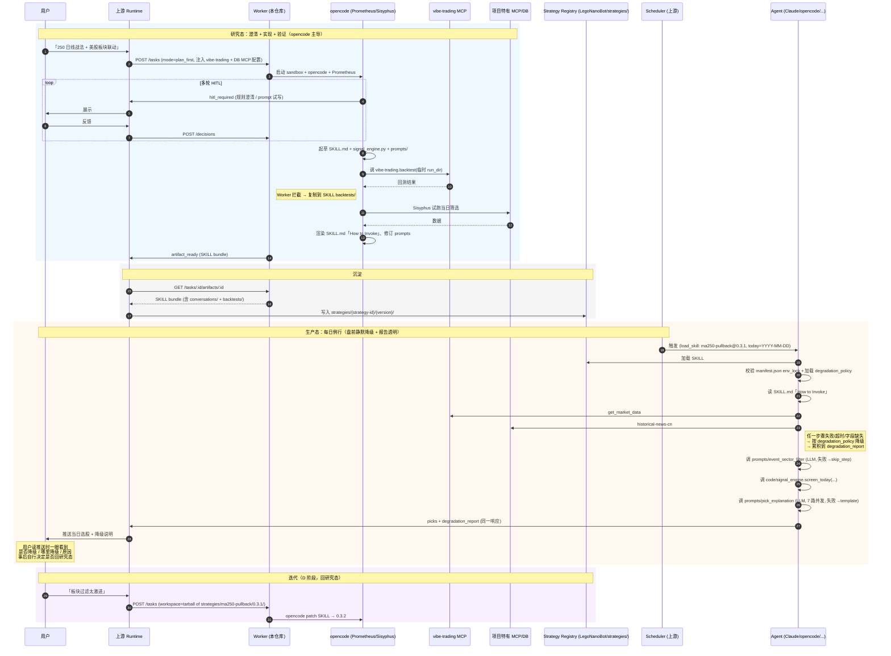

# Design: 战法产物形态 + 上游调度桥接

> **状态**：Draft v2（2026-05-15）—— 在 v1 基础上经 A 讨论收敛
> **来源**：brainstorm + A 讨论（场景：用户用模糊自然语言描述「250 日线战法」/「美股炒题材→A股板块联动」等，系统协助澄清 → 实现 → 沉淀 → 每日例行筛选）
> **范围**：本设计回答两个问题——
> 1. opencode worker 输出的「战法产物」应该长什么样？
> 2. 这个产物如何离开 worker，进入「每日例行执行」的生产态？
>
> **不在范围**：vibe-trading 业务实现细节、上游 runtime UI、风控/下单系统。

---

## Changelog

- **v1（2026-05-14）**：基于 brainstorm 输出，假设产物是自创 DSL bundle + 上游自建 runner，回测层属于上游。
- **v2（2026-05-15）**：A 讨论收敛三大 reframe ——
  1. **产物形态 = SKILL**（沿用 vibe-trading SKILL 既有约定 + 必要扩展），而非自创 DSL
  2. **生产态执行 = agent-led**（任何能 load_skill 的 agent 即可），而非自建 runner
  3. **vibe-trading 是起点不是终点**：opencode + Prometheus 与用户多轮对话，从 vibe-trading 的 MVP signal_engine 形态**逐步进化**为「完整 python 脚本 + 配套 prompts」的 SKILL；prompts 是一等公民，承载事件驱动型语义判断（如「美股炒航天 → A股关注航天板块」）
- **v2.1（2026-05-15）**：B 讨论收敛两条 ——
  1. **项目特有 MCP 维护在独立仓库** `LegoNanoBot/mcps/{mcp-name}/`（与 worker、与 vibe-trading 三方解耦）
  2. **manifest.json env_lock 强锁 tool + 字段 + 版本**：agent 加载 SKILL 时调 MCP schema introspection 比对，不一致即拒绝运行
- **v2.2（2026-05-15）**：B 讨论补充 vibe-trading fork 维度 ——
  1. **存在两个 vibe-trading 通道**：社区版（开源，多品类）+ 内部 A 股 fork（在社区版基础上选择性删改）
  2. **SKILL manifest 必须显式声明 channel**（`community` / `internal-a-share`），不允许"假定默认 vibe-trading"
  3. **反哺社区的 PR 流程**：内部 fork 的通用增强定期 PR 上游；A 股专属能力沉淀在内部 fork 不上推
- **v2.3（2026-05-15）**：D 讨论收敛 ——
  1. **命中说明 = 每只股票推送给用户的那段解释文字**（不是 SKILL.md 的 How to Invoke）
  2. **生成方式：每只 picks 单独 LLM 并发调用**（默认 7 次并发），用 cheap model 控成本
  3. **MVP 由 SKILL 自带 prompts/pick_explanation.md**；统一品牌风格退 Phase 7
- **v2.4（2026-05-15）**：C 讨论收敛 HITL 粒度 ——
  1. **研究态 HITL**：用户**就在旁边**，随时可 HITL 讨论；不预设"关键转折点"清单（Prometheus 默认 plan_first 行为已满足）
  2. **生产态 = 盘前静默降级**：所有异常默认走预设降级路径，**不暂停推送**
  3. **降级必须随推送报告同步输出**：当日推送的选股结果必须显式标注"是否降级、哪些步骤降级、降级原因"，让用户事后一眼看到
  4. **生产态没有 HITL 阻塞通道**；用户事后读降级报告，自行决定是否回研究态修战法
- **v2.5（2026-05-15）**：E 讨论收敛 ——
  1. **MVP Strategy Registry = 最小形态**：目录 + INDEX.json 列 active versions；无 tag / search / owner / shared components
  2. **INDEX.json schema 写定**：避免后续迁移成本；扩展字段（tags / status / dep graph）退 Phase 7
- **v2.6（2026-05-15）**：F 组（基础能力）OQ-1 / OQ-3 / OQ-9 闭环 ——
  1. **Meta-skill `strategy-skill-author` 由上游 runtime 维护**，通过 `opencode_profile` 自动注入给 Prometheus（OQ-1）
  2. **Worker 实现 conversations + backtests writeback**（Phase 6 增量），监听 SSE 事件按约定写入 SKILL bundle 对应目录（OQ-3）
  3. **MCP 调用字段自动回填 manifest**：worker 拦截 MCP 调用聚合实际读写字段，Prometheus 在 signal_engine 中"只读用到的字段"作为双保险（OQ-9）
- **v2.7（2026-05-15）**：G 组（命名规范）OQ-4 / OQ-5 / OQ-8 闭环 ——
  1. **strategy_id**：kebab-case，正则 `^[a-z][a-z0-9-]{2,40}$`，用户起名 + LLM 校 INDEX.json 冲突（OQ-4）
  2. **版本号**：SemVer；MAJOR=env/契约/数据变；MINOR=规则/prompts/编排变；PATCH=描述/参数微调（OQ-5）
  3. **conversations slug**：worker 终态前 LLM 总结 3-4 词；用户可在 final_acceptance 中覆盖（OQ-8）
- **v2.8（2026-05-15）**：H 组（校验机制）OQ-7 / OQ-12 闭环 ——
  1. **env_lock validator**：agent 加载时按 MCP→env→DB 顺序校验，**所有失败一次性聚合返回**（不 fail-fast）；输出 structured error（OQ-7）
  2. **channel mismatch**：默认 hard reject；提供 `--force-channel-mismatch` 显式开关，覆盖时入 audit log（OQ-12）
- **v2.9（2026-05-15）**：I 组（MCP 治理）OQ-10 / OQ-11 闭环 ——
  1. **vibe-trading 内部 fork PR 准入**：维护者 + 社区 maintainer 共同 review；细则在 fork repo 的 GOVERNANCE.md；通用增强 PR 上游、A 股专属沉淀内部、删除动作不上推（OQ-10）
  2. **项目特有 MCP 发布**：git tag + `pip install git+...@v{tag}`；docker image 选项留 Phase 7（OQ-11）
- **v2.10（2026-05-15）**：J 组（品质细节）OQ-2 / OQ-13 / OQ-14 / OQ-15 / OQ-16 闭环 ——
  1. **Offline Quantization Equivalent 强制**：每个 LLM step 的 prompts/*.md 必须有该章节，顶部声明 `quality: exact / approximate / partial`（OQ-2）
  2. **LLM 成本预算归属上游 runtime**：worker 不管，per-tenant 月度预算 + 接近阈值告警 + 超阈值降级模板（OQ-13）
  3. **LLM 输出不合 schema MVP 不二次纠错**：直接降级 `fallback_template_path`；Phase 7 评估 retry-with-correction（OQ-14）
  4. **degradation_report 字段英文 / 值中文**：i18n 退 Phase 7（OQ-15）
  5. **彻底跑不了仍推空报告 + 显眼降级标识**：用户每日"信号不缺席"原则（OQ-16）

---

## Table of Contents

- [1. 设计目标（G1~G9）](#1-设计目标)
- [2. 关键决策（D1~D19）](#2-关键决策a-讨论后更新)
- [3. SKILL Bundle 规格](#3-skill-bundle-规格)
  - [3.1 目录结构](#31-目录结构)
  - [3.2 SKILL.md 规格](#32-skillmd-规格)
  - [3.3 manifest.json — 机器可读环境锁](#33-manifestjson--机器可读环境锁)
  - [3.4 code/signal_engine.py 契约](#34-codesignal_enginepy-契约)
  - [3.5 prompts/ 目录约定 + Offline Equivalent](#35-prompts-目录约定)
  - [3.5.1 Pick Explanation Prompt 的特殊形态](#351-pick-explanation-prompt-的特殊形态d12)
  - [3.6.0 命名规范（OQ-4/5/8 闭环）](#360-命名规范g-组-oq-4--oq-5--oq-8-闭环)
  - [3.6 conversations / backtests writeback 约定](#36-conversations-与-backtests--worker-写入约定)
- [4. 生命周期：研究态 → 生产态](#4-生命周期研究态--生产态)
- [5. Worker 侧改动（最小化 + Phase 6 增量）](#5-worker-侧改动最小化)
  - [5.3 worker hooks（OQ-3 + OQ-9 闭环）](#53-新增-worker-side-机制f-组-oq-3--oq-9-闭环)
  - [5.4 现有依赖修复（前置）](#54-现有依赖修复前置)
  - [5.5 meta-skill `strategy-skill-author`（OQ-1 闭环）](#55-strategy-skill-meta-skillf-组-oq-1-闭环)
- [6. 上游侧需要构建的组件](#6-上游侧需要构建的组件)
  - [6.1 Strategy Registry（D16）](#61-strategy-registrymvp-最小形态d16)
  - [6.2 Agent Loader + 6.2.1 env_lock validator（D17 / OQ-7）](#62-agent-loader)
  - [6.5 MCP 仓库拓扑 + 发布形态（D18 / OQ-11）](#65-mcp-仓库拓扑d9--d11)
  - [6.6 MCP 自描述要求（强锁前提）](#66-mcp-自描述要求强锁的前提)
  - [6.7 vibe-trading 双通道治理（D11 + OQ-10/12）](#67-vibe-trading-双通道治理d11--oq-10-闭环)
- [7. 回测复用](#7-回测复用g6)
- [8. Open Questions（已全部闭环 ✅）](#8-open-questions已全部闭环-)
- [9. 分阶段交付建议（Phase X1/X2/X3）](#9-分阶段交付建议)
- [10. 与 ADR 的关系](#10-与-adr-的关系)
- [11. Implementation Readiness Summary](#11-implementation-readiness-summary)
- [12. Next Step](#12-next-step)
- [13. ADR Updates 提示](#13-adr-updates-提示)

---

## 1. 设计目标

| # | 目标 | 来源 |
|---|---|---|
| G1 | 产物可被**任意 skill-aware agent**（Claude / opencode / vibe-trading-mcp）加载执行 | A 讨论收敛 |
| G2 | 产物可被**审计 / 复现**：携带演进对话、回测证据、版本号 | brainstorm AC + 用户要求 |
| G3 | 用户可**精准修改**（一条规则 / 一段 prompt）→ 新版本，不重写整个 SKILL | brainstorm AC-3 |
| G4 | **不破坏 worker 通用契约**（ADR-001） | brainstorm Q2 答案 |
| G5 | 数据访问通过**上游注入的 MCP**（vibe-trading + 项目特有 MCP） | brainstorm Q4 |
| G6 | 同一份产物可被**回测层**（vibe-trading.backtest）和**生产态**（每日选股）共同消费 | brainstorm Open Q3 |
| G7 | 显式声明「环境锁」：缺特定 MCP/DB/凭据时拒绝运行 | A 讨论新增 |
| G8 | 生产态执行**结构化少量 LLM 调用**（事件驱动语义部分），非纯确定性也非 free-form opencode | A 讨论新增 |
| G9 | **MCP 升级不能静默破坏 SKILL**：SKILL manifest 强锁 tool/字段/版本，agent 加载时校验 | B 讨论新增 |

---

## 2. 关键决策（A 讨论后更新）

| 决策 | 选择 | 替代 | 理由 |
|---|---|---|---|
| **D1. 产物形态** | **SKILL**（vibe-trading SKILL 约定 + 扩展目录） | 自创 DSL bundle / 纯 vibe-trading run_dir | 复用既有标准；agent 原生可消费；自然支持版本与依赖声明 |
| **D2. 执行核心** | vibe-trading `class SignalEngine` 接口 + 可调 `LLMProvider` | 纯函数 selector | 与 vibe-trading 兼容；同时支持事件驱动型 LLM 中介逻辑 |
| **D3. 宿主目录** | `LegoNanoBot/strategies/{strategy-id}/{version}/` 独立目录（不污染开源 vibe-trading） | 进 vibe-trading skills/ / 双轨 | 治理边界清；通过 strategy registry 让 agent 发现 |
| **D4. 生产态执行** | **agent-led**：任何能 `load_skill` 的 agent 直接消费 SKILL | 自建 runner / 复用 worker 加新 mode | SKILL.md 本质是 agent 的 prompt，无需额外编排层 |
| **D5. Worker 契约** | **零变更**；artifact 元数据加 `subtype: strategy_skill` | 加 task mode / artifact type enum | 守住 G4；ADR-001 不动 |
| **D6. 版本不可变** | `{strategy-id}/{version}/` 写完即冻结；改动 = 新版本目录 | 就地编辑 + git diff | 复现性 + 审计需求 |
| **D7. vibe-trading 关系** | vibe-trading run_dir 是 baseline；SKILL bundle 是其 superset（含 prompts/conversations/backtests） | 完全独立 / 完全替代 | 用户实际工作流验证：从 vibe-trading MVP 迭代演化 |
| **D8. Code↔Prompts 编排** | **Agent 主导**：SKILL.md 用自然语言指引 agent 何时调 code、何时调 prompt | code 内嵌 LLM / orchestration.yaml DSL | SKILL.md 本身就是 prompt，不需要额外编排 schema |
| **D9. 项目特有 MCP 归属** | 独立仓库 `LegoNanoBot/mcps/{mcp-name}/`（与 worker、vibe-trading 三方解耦） | 进 vibe-trading / worker monorepo / 监仓 | 边界清；版本治理独立；不被开源节奏拖累 |
| **D10. SKILL ↔ MCP 字段锁定** | **强锁**：manifest 列出每个 tool 的 input/output 必备字段 + min_version；agent 加载时通过 MCP schema introspection 校验 | 软锁（运行时报错） / 不锁（黑盒） | G9；可承担「opencode 生成时如实记录」的代价换取生产态零静默故障 |
| **D11. vibe-trading 双通道** | SKILL manifest 用 `channel: community \| internal-a-share` 显式声明依赖通道；内部 A 股 fork 单独仓库维护，定期反哺社区 | 默认社区 / 默认内部 / 不区分 | A 股深耕需要内部 fork 选择性删改，但不能让 SKILL 因此与社区脱节；显式 channel 让 portability 风险可见 |
| **D12. 命中说明生成** | **每只 picks 单独 LLM 并发调用**（默认 7 路并发，用 cheap model）；MVP SKILL 自带 prompts/pick_explanation.md | 模板 / 批量单调用 / 分层 | 用户已采纳成本换语义自由：事件驱动战法（如「美股炒航天 → A 股板块联动」）不带 LLM 说明就失去核心价值 |
| **D13. 研究态 HITL 粒度** | 用户**就在旁边**：worker 现有 plan_first / HITL 机制照常工作；不预设"关键转折点"清单；用户随时可介入 | 预设触发列表 / 全自动一次性终审 | 用户在场场景下，预设触发反而僵化；信任 Prometheus 默认对话节奏 |
| **D14. 生产态异常处理** | **盘前静默降级**：所有异常走预设降级路径，**不暂停推送** | 暂停 + HITL / 分级 / 仅日志 | 用户盘前不在线，阻塞反而失去推送价值；降级 + 透明报告兼顾自动化与可见性 |
| **D15. 降级报告随推送输出** | 当日选股结果**必须显式包含 degradation report**：是否降级 / 哪些步骤降级 / 原因 / 影响范围 | 单独通知 / 仅入 audit log | 用户读推送时一眼看到状态；事后可基于报告自行决定是否回研究态修战法 |
| **D16. MVP Strategy Registry** | 最小形态：目录 + INDEX.json (latest_active_version + all_versions + channel)；无 tag/search/owner | 加 tag/status / 加 dep graph / 不做 registry | 当前 1-3 个战法，过度设计无意义；schema 写定避免后续迁移；扩展退 Phase 7 |
| **D17. env_lock validator 行为** | Agent 加载 SKILL 时按 MCP→env→DB 顺序校验，**聚合所有失败一次性返回**；channel mismatch 默认 hard reject，可 `--force-channel-mismatch` 覆盖（入 audit log） | fail-fast / 警告不阻塞 / 仅日志 | 一次性看清缺什么远好于反复重试；hard reject 防误用，force flag 留给紧急场景 |
| **D18. 项目特有 MCP 发布形态** | git tag + `pip install git+https://.../mcps/{name}.git@v{tag}`；opencode_profile 引用具体 tag | docker image / pypi 私服 / monorepo | MVP 最简；docker image 等多用户 / 隔离场景再加 |
| **D19. Offline Quantization Equivalent 强制** | 每个 LLM step 的 prompts/*.md 必须含该章节 + 顶部 `quality: exact / approximate / partial` 声明；approximate 的回测结果在报告显式标注 | 不强制 / 强制 + 单一 quality | 让回测/实盘语义脱节风险显式可见；quality 等级让用户判断回测可信度 |

---

## 3. SKILL Bundle 规格

### 3.1 目录结构

```
LegoNanoBot/strategies/
└── {strategy-id}/                          # e.g. ma250-pullback
    ├── REGISTRY.md                          # （可选）策略级元信息：用途、负责人、维护状态
    └── {version}/                           # e.g. 0.3.1 — 不可变
        │
        │ ─── SKILL 标准部分（可被 vibe-trading SKILL 加载器识别） ───
        ├── SKILL.md                         ★ frontmatter + agent-readable 指引
        ├── example_signal_engine.py         # vibe-trading 习惯入口（可指向 code/）
        ├── references/                      # 参考资料（学术论文链接、术语表等）
        │
        │ ─── 实际可执行部分 ───
        ├── code/
        │   ├── signal_engine.py             # vibe-trading SignalEngine 接口
        │   └── helpers/                     # 可选：拆分模块
        ├── config.json                      # vibe-trading run_dir 兼容
        ├── prompts/                         # ★ runtime LLM 调用的 prompt 模板
        │   ├── event_sector_filter.md
        │   ├── candidate_ranking.md
        │   └── pick_explanation.md
        │
        │ ─── 演进证据（worker 写入） ───
        ├── conversations/                   # 形成本版本的对话历史
        │   ├── 2026-05-14-initial.jsonl
        │   └── 2026-05-15-tune-pullback.jsonl
        ├── backtests/                       # 回测验证记录
        │   └── 2026-05-15-baseline/        # 复制自 vibe-trading runs/
        │       ├── config.json
        │       ├── metrics.json
        │       └── ...
        │
        │ ─── 元数据 ───
        ├── manifest.json                    ★ 机器可读：环境锁 + 依赖
        ├── CHANGELOG.md                     # 版本演进说明
        └── checksums.txt                    # 文件 sha256
```

**不可变性约束**：每个 `{version}/` 目录写完即冻结。修改 = 新版本（`0.3.1` → `0.3.2`），不就地改。

### 3.2 SKILL.md 规格

**沿用 vibe-trading 现有 frontmatter 范式**（参考 `vibe-trading/agent/src/skills/harmonic/SKILL.md`）：

```markdown
---
name: ma250-pullback
description: 250 日均线回踩战法：股价站稳 250 日线后回踩确认入场，每日筛 ≤7 只
category: strategy
version: 0.3.1
---

# 250 日均线回踩战法

## Purpose
此 SKILL 实现「250 日均线回踩」战法，并支持事件驱动的板块联动叠加。
适用于 A 股每日例行选股场景，输出 ≤7 只候选 + 命中说明。

## When to Use
- 用户已通过 conversations/ 中的对话明确同意此战法逻辑
- 当前交易日为 A 股开市日
- 必备 MCP 与凭据已就绪（见 manifest.json）

## How to Invoke

### 每日选股流程
1. **读取候选域**：通过 `vibe-trading.get_market_data` 拉取全 A 当日基础数据
2. **板块过滤（LLM 介入）**：
   - 加载 `prompts/event_sector_filter.md`
   - 用今日新闻（通过 `historical-news-cn` MCP 查 T-1 日 close → 当日 open 区间）作为输入
   - LLM 输出当日关注板块列表
3. **确定性筛选**：调用 `code/signal_engine.py::SignalEngine.generate(data_map)`，结合板块过滤
4. **排序 + 截断**：按 `(close - ma250)/ma250` 升序，取前 7
5. **生成说明（LLM 介入）**：每只用 `prompts/pick_explanation.md` 生成命中说明

### 回测流程
直接调用 `vibe-trading.backtest(<this-skill-dir>)`，框架自动读取 `config.json` 与 `code/signal_engine.py`。
> ⚠️ 回测路径目前**不**复现板块过滤步骤的 LLM 行为；如需带语义层回测，见 prompts/event_sector_filter.md 末尾的「离线量化等价物」章节。

## Inputs / Outputs
| 输入 | 来源 | 描述 |
|---|---|---|
| `today` | scheduler | 交易日 (YYYY-MM-DD) |
| `news_window` | `historical-news-cn` MCP | T-1 close → T open 新闻 |
| `bars` | `vibe-trading.get_market_data` | 全 A 日 K 含 250 日历史 |

| 输出 | 形态 | 描述 |
|---|---|---|
| picks | `list[Pick(symbol, score, fields, reason_text)]` | ≤7 只 |

## Dependencies
见 `manifest.json` 的 `required_mcps` / `required_env` / `required_db`。

## Provenance
- 形成对话：`conversations/`
- 回测验证：`backtests/`
- 历史变更：`CHANGELOG.md`
```

### 3.3 manifest.json — 机器可读环境锁

```jsonc
{
  "schema_version": "1.0",
  "strategy_id": "ma250-pullback",
  "version": "0.3.1",

  "provenance": {
    "created_by": "opencode-worker",
    "worker_commit": "e32c5e5",
    "opencode_version": "1.15.0",
    "ohmy_version": "4.1.2",
    "primary_session_id": "sess_xxx",
    "created_at": "2026-05-15T10:30:00+08:00"
  },

  "skill": {
    "skill_md_path": "SKILL.md",
    "agent_compatibility": ["claude-code", "opencode", "vibe-trading-mcp"]
  },

  "execution": {
    "entry_module": "code/signal_engine.py",
    "entry_class": "SignalEngine",
    "entry_method": "generate"
  },

  "env_lock": {                              // G7 + G9: 缺一即拒绝运行；强锁字段
    "required_mcps": [
      {
        "name": "vibe-trading",
        "channel": "internal-a-share",       // ★ D11：必须显式声明
        "min_version": "0.2.1",              // 内部 fork 版本号
        "upstream_baseline": ">=0.1.7",      // 此 fork 仍保持兼容的社区版基线
        "source": "git:LegoNanoBot/vibe-trading-a-share@v0.2.1",
        "tools_used": [
          {
            "tool_name": "get_market_data",
            "required_input_fields":  ["codes", "start_date", "end_date", "source", "interval"],
            "required_output_fields": ["close_adj", "low_adj", "volume", "date"]
          },
          {
            "tool_name": "backtest",
            "required_input_fields":  ["run_dir"],
            "required_output_fields": ["metrics", "equity_curve"]
          }
        ]
      },
      {
        "name": "trading-data-cn",            // 项目特有
        "min_version": "1.0",
        "source": "git:LegoNanoBot/mcps/trading-data-cn@v1.0.3",
        "tools_used": [
          {
            "tool_name": "get_security_meta",
            "required_input_fields":  ["symbols"],
            "required_output_fields": ["symbol", "name", "industry", "is_st", "listed_date", "board"]
          },
          {
            "tool_name": "get_universe",
            "required_input_fields":  ["date", "filters"],
            "required_output_fields": ["symbols"]
          }
        ]
      },
      {
        "name": "historical-news-cn",         // 项目特有
        "min_version": "1.0",
        "source": "git:LegoNanoBot/mcps/historical-news-cn@v1.0.1",
        "tools_used": [
          {
            "tool_name": "query_news",
            "required_input_fields":  ["start_time", "end_time", "categories"],
            "required_output_fields": ["news_id", "title", "summary", "categories", "published_at"]
          }
        ]
      }
    ],
    "required_env": [
      {"name": "TUSHARE_TOKEN",      "purpose": "China A-share market data"},
      {"name": "DEEPSEEK_API_KEY",   "purpose": "LLM steps in event_sector_filter / pick_explanation"}
    ],
    "required_db": [
      {"alias": "market_data_cn",    "kind": "postgres", "purpose": "intraday cache"}
    ]
  },

  "llm_steps": {                             // G8: 声明会调用 LLM 的 prompt
    "event_sector_filter": {
      "prompt_path": "prompts/event_sector_filter.md",
      "model": "deepseek/deepseek-v3.2",
      "temperature": 0.0,
      "max_tokens": 512,
      "called_by": "skill_md"               // 由 SKILL.md 引导 agent 调用
    },
    "pick_explanation": {
      "prompt_path": "prompts/pick_explanation.md",
      "model": "deepseek/deepseek-v3.2",            // cheap model 控成本
      "temperature": 0.3,
      "max_tokens": 256,
      "called_by": "skill_md",
      "invocation_mode": "per_pick_concurrent",     // ★ D12: 每只单独并发
      "concurrency_limit": 7,                       // 与 ranking.limit 对齐
      "fallback_template_path": "reason_template.md" // LLM 失败时降级模板
    }
  },

  "data_contract": {                         // 用于 vibe-trading.backtest 输入校验
    "frequency": "daily",
    "fields": ["close_adj", "low_adj", "volume"],
    "history_days": 260,
    "adjustment": "forward",
    "asof_time": "T 16:30 CST"
  },

  "limits": {                                        // SKILL 自带技术限流，硬性
    "production_runtime_sec": 120,
    "production_max_llm_calls": 20,                  // event_filter(1) + pick_explanation(7) + 余量
    "per_step_max_llm_calls": {
      "event_sector_filter": 1,
      "pick_explanation": 10                         // 上限略高于 ranking.limit 防边界
    }
  },

  // 注：成本预算（OQ-13 闭环）由上游 runtime 维护 per-tenant 月度配额，
  // 不在 SKILL 内声明（SKILL 不感知租户）。上游负责：
  // - 每次 agent 调度前查租户余额 → 不足则降级 reason_template（覆盖 SKILL 默认）
  // - 接近 80% 月度阈值 → 告警通知
  // - 超阈值 → 强制降级模板 + 在 degradation_report 中标注 "budget_exceeded"


  "degradation_policy": {                            // ★ D14 + D15: 盘前静默降级 + 透明报告
    "rules": [
      {
        "trigger": "llm_step_failed",
        "step": "event_sector_filter",
        "action": "skip_step",                       // 跳过事件过滤，全 universe 进入下一步
        "report_text": "事件板块过滤步骤失败，本日选股未叠加事件驱动语义"
      },
      {
        "trigger": "llm_step_failed",
        "step": "pick_explanation",
        "action": "fallback_to_template",            // 降到 reason_template.md
        "report_text": "命中说明 LLM 失败，已用模板生成"
      },
      {
        "trigger": "required_field_missing",
        "field": "any",
        "action": "skip_affected_picks",
        "report_text": "{count} 只候选因关键字段缺失被剔除"
      },
      {
        "trigger": "required_mcp_unavailable",
        "mcp": "any",
        "action": "abort_with_report",               // 极端情况：彻底跑不了，仍出空报告
        "report_text": "{mcp_name} 不可用，本日无法产出选股；建议人工介入"
      },
      {
        "trigger": "picks_count_below_target",
        "action": "push_partial",                    // 推送 < N 只
        "report_text": "本日仅命中 {actual} 只（目标 {target}）"
      },
      {
        "trigger": "data_freshness_violation",
        "max_lag_minutes": 60,
        "action": "push_with_warning",
        "report_text": "数据延迟 {lag_minutes} 分钟于 asof_time，可能影响命中精度"
      }
    ],
    "report_format": {
      "must_include": ["degraded", "degraded_steps", "reasons", "impact"],
      "delivery": "embedded_in_picks_response",      // 与选股结果同结构同推送
      "field_naming": "english",                     // OQ-15: 字段名英文（程序消费）
      "value_locale": "zh-CN",                       // OQ-15: 值默认中文（用户消费）
      "i18n_phase": 7                                // OQ-15: i18n 退 Phase 7
    },
    "abort_with_report_behavior": {                  // OQ-16 闭环
      "still_push_empty_picks": true,                // 即使彻底跑不了，也推送空 picks
      "ui_emphasis": "high",                         // UI 必须显眼标注「今日无可推送候选」
      "rationale": "用户每日「信号不缺席」原则；避免无推送被误读为正常"
    }
  },

  "checksums_path": "checksums.txt"
}
```

### 3.4 code/signal_engine.py 契约

**与 vibe-trading SignalEngine 兼容**：

```python
class SignalEngine:
    """
    与 vibe-trading 既有 SignalEngine 接口一致：
    https://github.com/.../vibe-trading/agent/backtest/runner.py
    """

    def generate(self, data_map: dict[str, pd.DataFrame]) -> dict[str, pd.Series]:
        """回测路径：返回 per-symbol 信号时间序列。
        signal: 1=long, -1=short, 0=stand aside（vibe-trading 约定）。"""
        ...
```

**生产态额外接口（非 vibe-trading 强制，但 SKILL.md 会 surface 给 agent）**：

```python
def screen_today(
    self,
    data_map: dict[str, pd.DataFrame],
    today: date,
    sector_filter: list[str] | None = None,    # 来自 LLM 步骤
    limit: int = 7,
) -> list[Pick]:
    """生产态：当日 cross-sectional 筛选 + top-N，返回 picks 列表。"""
    ...
```

> **关于回测 vs 生产的 mismatch**（A 阶段发现的关键 gap）：vibe-trading 的 `generate(data_map) -> signals` 是 per-symbol time-series 模式，与「每日 top-N 选股」语义不直接对应。本设计采纳的方案是**双入口**：`generate()` 用于回测兼容，`screen_today()` 用于生产。SKILL.md 明确指引 agent 何时调用哪个。

### 3.5 prompts/ 目录约定

每个 prompt 文件结构：

```markdown
---
prompt_id: event_sector_filter
input_schema:
  news_summary: string         # T-1→T 区间新闻摘要
  reference_markets: [string]  # 例如 ["US", "HK"]
output_schema:
  focus_sectors: [string]
  rationale: string
model_default: deepseek/deepseek-v3.2
---

# Event-driven Sector Filter

## Task
...

## Input Format
...

## Output Format (strict JSON)
```json
{"focus_sectors": [...], "rationale": "..."}
```

## Examples
...

## Offline Quantization Equivalent (回测路径用)
> quality: approximate
>
> 回测时无法实时调 LLM。等价的离线信号：取 T-1 日美股 sector ETF 涨幅 >2% 且
> 中文新闻里同板块词频 >N 的板块。详见 `code/helpers/offline_news_proxy.py`。
>
> 与 LLM 输出的差异：离线版只用结构化数据，可能漏掉新闻中的语义信号
> (如"政策利好""龙头公司动态")，导致回测高估或低估若干板块。
```

`Offline Quantization Equivalent` 章节**强制必备**（D19 / OQ-2 闭环）：

- **顶部声明 quality**：
  - `exact` —— 离线信号与 LLM 输出在数学上一致（如纯模板化的过滤）
  - `approximate` —— 离线信号近似 LLM 行为，可能有偏差
  - `partial` —— 离线信号只覆盖部分场景，其他场景默认放过或保守处理
- **必须列出与 LLM 输出的差异**：让用户判断回测可信度
- **`approximate` / `partial` 的回测结果必须在报告中显式标注**，避免误导
- meta-skill `strategy-skill-author` 的 checklist 必须勾选"已写 Offline Equivalent"

### 3.5.1 Pick Explanation Prompt 的特殊形态（D12）

`prompts/pick_explanation.md` 是 SKILL 中**几乎必备**的 prompt，规范如下：

```yaml
prompt_id: pick_explanation
invocation_mode: per_pick_concurrent           # 与 manifest.llm_steps 对齐
input_schema:
  pick:                                        # 单只股票上下文
    symbol: string
    name: string
    score: float
    fields: object                             # 命中规则用到的指标值
    matched_rules: [string]                    # 命中的 rule_id 列表
  context:                                     # 共享上下文
    today: date
    sector_filter: [string]                    # 当日 LLM 输出的关注板块
    news_window: object                        # T-1→T 关键新闻摘要
output_schema:
  reason_text: string                          # 推送给用户的解释文字
  confidence: enum[high, medium, low]          # LLM 自评，可用于过滤
fallback_template:                             # LLM 失败/超时降级
  path: ../reason_template.md
```

**降级机制**：若 LLM 调用失败 / 超时 / 输出不合 schema，agent 必须落回 `fallback_template_path`（manifest.json 字段）。降级行为 + 比例需写入 audit log。

**MVP 不做二次纠错（OQ-14 闭环）**：
- LLM 输出不合 schema 时**直接降级**到 `fallback_template_path`，不做"corrective retry"
- 理由：节省成本 + 复杂度；模板降级足够安全
- Phase 7 评估：n=1 retry with corrective prompt → 仍失败再降级

### 3.6.0 命名规范（G 组 OQ-4 / OQ-5 / OQ-8 闭环）

| 实体 | 规范 | 例子 |
|---|---|---|
| **strategy_id** | kebab-case，`^[a-z][a-z0-9-]{2,40}$`；用户起名；LLM 在生成时主动查 INDEX.json 撞名 | `ma250-pullback`、`us-aerospace-event`、`hk-southbound-flow` |
| **version** | SemVer `MAJOR.MINOR.PATCH` | `0.3.1` |
| **MAJOR bump** | env_lock / SignalEngine 接口 / data_contract 任一变化 | 数据源切换、required MCP 增减、字段语义变化 |
| **MINOR bump** | 规则 / prompts / orchestration 变化 | 新增规则、调 ranking 公式、prompt 重写 |
| **PATCH bump** | 描述措辞 / 模板微调 / 参数小调 | ma 窗口 250→248、reason_template 文案 |
| **version 目录** | `{strategy-id}/{version}/`；写完即冻结 | `ma250-pullback/0.3.1/` |
| **conversations slug** | worker 在任务终态前用一次轻量 LLM 调用总结 3-4 词；用户可在 final_acceptance 时覆盖 | `2026-05-15-tune-pullback`、`2026-05-15-add-volume-rule` |
| **backtests label** | 默认 `iter-N`（N 自增），可由 prompt 上下文覆盖（如 `baseline` / `with-event-overlay`） | `2026-05-15-baseline/` |

### 3.6 conversations/ 与 backtests/ —— Worker 写入约定

| 目录 | 写入时机 | 写入逻辑 |
|---|---|---|
| `conversations/{ISO8601}-{slug}.jsonl` | Worker 任务终态时 | Worker 提取 opencode session messages → JSONL；slug 由 LLM 总结用户首条 message 得到（3-4 词，去标点连字符） |
| `backtests/{ISO8601}-{label}/` | opencode 调用 `vibe-trading.backtest(...)` MCP 后 | Worker 拦截 MCP 结果，复制 vibe-trading runs/ 输出目录；label 默认 `iter-N`（N 自增），可由 prompt 上下文覆盖 |

这两件**worker-side 机制**会在 Phase 6/7 实现。现阶段标注为 OQ。

---

## 4. 生命周期：研究态 → 生产态



---

## 5. Worker 侧改动（最小化）

### 5.1 契约变更
**无。** 现有 `Artifact` schema 已支持 `type=custom`。

### 5.2 新增约定

```jsonc
{
  "type": "custom",
  "subtype": "strategy_skill",         // 新增标签
  "name": "ma250-pullback-0.3.1.tar.gz",
  "metadata": {
    "strategy_id": "ma250-pullback",
    "version": "0.3.1",
    "skill_md_path": "SKILL.md",
    "manifest_path": "manifest.json"
  }
}
```

### 5.3 新增 worker-side 机制（F 组 OQ-3 + OQ-9 闭环）

属于 Phase 6 收尾或 Phase 7 增强；**三个 hook 共享同一套 SSE 拦截基础设施**：

- **Conversations writer**：监听 opencode SSE 的 `assistant_delta` / `tool_call_*` / `decision_received` 事件，组装 messages 数组，任务终态时输出 JSONL 到 `conversations/{ISO8601}-{slug}.jsonl`
- **Backtest interceptor**：监听 `tool_call_finished` 事件，识别 `vibe-trading.backtest` 调用，复制 vibe-trading runs/ 输出目录到 SKILL bundle 的 `backtests/{ISO8601}-{label}/`
- **MCP field auto-recorder**（OQ-9）：监听**所有** `tool_call_finished` 事件，按 `(mcp_name, tool_name)` 维度聚合：
  - 实际传入的 input field 名（从调用 args 提取）
  - 实际读取的 output field 名（需 Prometheus 在生成的 signal_engine.py 中遵循"只读用到的字段"约定 — 双保险）
  - 任务终态时回填到 `manifest.json` 的 `env_lock.required_mcps[].tools_used[].required_*_fields`

### 5.4 现有依赖修复（前置）

执行本设计前必须关：
- **P0-5**：agent 名修回 Prometheus/Sisyphus
- **P0-6 / P0-7**：终态事件正确性
- **P1-13 / P1-14**：HITL `on_timeout` / `auto_approve` 字段实装

### 5.5 strategy SKILL meta-skill（F 组 OQ-1 闭环）

**归属**：上游 runtime 维护的一个 meta-skill，名为 `strategy-skill-author`。
**注入**：通过 worker 的 `opencode_profile` 字段自动注入给 Prometheus，与其他业务 skills 同等待遇。
**为什么不在 worker**：worker 不感知业务（守 ADR-001）；meta-skill 是"如何写 strategy SKILL"的业务知识，与 vibe-trading skills 体系同源。

**meta-skill 内容（草稿）**：
- SKILL.md 必备小节（Purpose / When to Use / How to Invoke / Inputs/Outputs / Dependencies / Provenance）
- frontmatter 字段约定（name / description / category / version）
- prompts/ 命名约定与必备 schema（input_schema / output_schema / fallback）
- manifest.json env_lock 字段映射规则（含 D11 channel 显式声明）
- references/ 推荐内容（学术引用、术语表）
- 自检 checklist（Prometheus 生成 SKILL 后自查每条勾选）

**演进路径**：发现 SKILL 质量问题 → 改 meta-skill → 下次 Prometheus 自动跟进，无需改 worker。

---

## 6. 上游侧需要构建的组件

### 6.1 Strategy Registry（MVP 最小形态，D16）

```
LegoNanoBot/strategies/
├── INDEX.json
└── {strategy-id}/
    ├── REGISTRY.md              # （可选）策略级元信息
    └── {version}/               # 不可变
```

**INDEX.json schema（写定，避免迁移成本）**：

```jsonc
{
  "schema_version": "1.0",
  "updated_at": "2026-05-15T10:30:00+08:00",
  "strategies": {
    "ma250-pullback": {
      "latest_active_version": "0.3.1",       // scheduler 默认加载这个
      "all_versions": [
        {
          "version": "0.3.1",
          "created_at": "2026-05-15T10:30:00+08:00",
          "channel": "internal-a-share",       // 与 manifest 一致
          "is_active": true                     // 仅一条为 true
        },
        {
          "version": "0.3.0",
          "created_at": "2026-05-14T15:00:00+08:00",
          "channel": "internal-a-share",
          "is_active": false
        }
      ]
    }
  }
}
```

**MVP 不包含**（退 Phase 7）：
- tags / categories / search index
- owner / RBAC / sharing
- dependency graph / shared components reference
- usage telemetry / last_run_date
- API（仅文件系统读写）

未来可演进为带 API 的轻服务（list / load / pin / deprecate / search）。

### 6.2 Agent Loader
任何 skill-aware agent 都可作为 loader：
- **Claude Code**：通过 `claude-code` 的 skill 加载机制
- **opencode**：通过 `opencode + oh-my-opencode` 的 skill loader
- **vibe-trading-mcp**：`load_skill(name)` MCP 工具

### 6.2.1 env_lock validator 校验流程（D17 / OQ-7 闭环）

Agent 加载 SKILL 时，**必须**按以下顺序执行校验。所有失败**一次性聚合返回**（不 fail-fast），让用户一眼看清环境缺什么。

```
1. Channel check
   manifest.env_lock.required_mcps[].channel  vs  当前环境实际通道
   ↓ 不匹配 → 收集到 mismatch[]
   （除非启动时带 --force-channel-mismatch，此时 warn + audit log）

2. MCP existence + version check
   for each m in required_mcps:
       a. 检查 m.name 在当前 agent runtime 注册的 MCP 列表中
       b. 检查 m.version >= m.min_version
   ↓ 失败 → 收集到 missing_mcps[] / version_too_old[]

3. MCP schema introspection (强锁的核心，OQ-9 闭环依赖)
   for each m, for each tool in m.tools_used:
       a. 调用 m.describe_tool(tool.tool_name)
       b. 比对 tool.required_input_fields  ⊆  实际 input schema 字段
       c. 比对 tool.required_output_fields ⊆  实际 output schema 字段
   ↓ 失败 → 收集到 schema_diffs[]

4. Required env check
   for each e in required_env:
       检查 os.environ.get(e.name) is not None
   ↓ 失败 → 收集到 missing_env[]

5. Required DB check
   for each db in required_db:
       试连接 (timeout=5s)
   ↓ 失败 → 收集到 unreachable_db[]
```

**Structured error 返回格式**（聚合所有 stage）：

```jsonc
{
  "kind": "env_lock_validation_failed",
  "skill_id": "ma250-pullback@0.3.1",
  "stages_failed": ["mcp_schema", "required_env"],
  "details": {
    "channel_mismatch": [],
    "missing_mcps": [],
    "version_too_old": [],
    "schema_diffs": [
      {
        "mcp": "trading-data-cn",
        "tool": "get_security_meta",
        "missing_output_fields": ["board"],
        "actual_output_fields": ["symbol", "name", "industry", "is_st", "listed_date"]
      }
    ],
    "missing_env": ["DEEPSEEK_API_KEY"],
    "unreachable_db": []
  },
  "remedy_hint": "请安装 trading-data-cn >= 1.1（含 board 字段）并配置 DEEPSEEK_API_KEY"
}
```

`remedy_hint` 由 agent 根据 details 自动生成（模板化），方便用户快速定位。

### 6.3 Scheduler
不强制选型。最简单 cron + 脚本（脚本启动 agent 加载 skill）。
唯一约束：调度时机在 `data_contract.asof_time` 之后。

### 6.4 用户回环：迭代触发
1. 上游从 Registry 拉出最新 SKILL（整个 `{version}/` 目录）
2. 作为 `workspace.kind=tarball` 注入新 task
3. `messages` 中带「我想把 X 改成 Y」
4. opencode 在已有 SKILL 基础上 patch，新版本号自增
5. Worker 写入新 `{version}/`，**老版本不改**

### 6.5 MCP 仓库拓扑（D9 + D11）

```
┌──────────────────────────────────────────────────────────────┐
│ 社区 vibe-trading (开源, 多品类)                              │
│ github.com/.../vibe-trading                                   │
│   tools: backtest, factor_analysis, get_market_data, ...      │
└──────────────────────────────────────────────────────────────┘
              ↑ 反哺通用增强 (定期 PR)
              │
              │ fork + 选择性删改 (A 股聚焦)
              ↓
┌──────────────────────────────────────────────────────────────┐
│ 内部 vibe-trading fork (LegoNanoBot/vibe-trading-a-share)     │
│   - 删除：crypto / forex / okx loader 等非 A 股能力           │
│   - 增强：A 股财务字段 / 行业树 / 龙虎榜 等                   │
│   - SKILL manifest 用 channel="internal-a-share" 引用         │
└──────────────────────────────────────────────────────────────┘
              ↑ 同环境内并存
              │
┌──────────────────────────────────────────────────────────────┐
│ 项目特有 MCP (LegoNanoBot/mcps/)                              │
│ ├── trading-data-cn/      (A 股元数据 / 行业 / universe)      │
│ ├── historical-news-cn/   (历史新闻、公告、事件)              │
│ └── ... (按需新增)                                            │
│   - 各自独立仓库 + stdio server + JSON Schema 自描述           │
│   - 独立 semver 发布                                          │
└──────────────────────────────────────────────────────────────┘
```

**MCP 发布形态（D18 / OQ-11 闭环）**：
- 每个 MCP 独立 git 仓库 + git tag 标记 release
- 安装方式：`pip install git+https://github.com/LegoNanoBot/mcps-{name}.git@v{tag}`
- `opencode_profile.mcp` 引用具体 git tag（不允许 `@latest` 或 `@main`，避免漂移）
- Docker image 选项 Phase 7（多用户 / 隔离场景再加）
- 每个 MCP 仓库**必须**含：
  - `README.md` —— 工具列表 + 接入示例
  - `pyproject.toml` —— 标记 entry_point（让 `pip install` 后能直接 `xxx-mcp --transport stdio`）
  - `schemas/` —— 每个 tool 的 JSON Schema（input + output），用于 D17 校验
  - `CHANGELOG.md` —— SemVer 变更记录

### 6.6 MCP 自描述要求（强锁的前提）

为支持 D10 的强锁校验，**所有被 SKILL 引用的 MCP** 必须导出：

- `list_tools()` —— 返回所有 tool 名 + 版本
- `describe_tool(name)` —— 返回该 tool 的 input/output JSON Schema
- 顶层 `version` 字段（与 git tag / pypi 版本一致）

Agent 加载 SKILL 时调用 `describe_tool` 比对 manifest 的 `tools_used.required_*_fields`，缺失/重命名/类型不兼容即拒绝运行并列出 diff。

### 6.7 vibe-trading 双通道治理（D11 + OQ-10 闭环）

**变更分类（写入内部 fork CHANGELOG 必备字段）**：
| 类型 | 含义 | 是否上推社区 |
|---|---|---|
| `merge` | 同步社区 master 的变更 | N/A（已在社区） |
| `enhance-upstream` | 内部新增的通用增强（非 A 股专属） | ✅ 落地后 N 周内 PR 上游 |
| `internal-only` | A 股专属能力（龙虎榜 / 北向资金 / ST 治理）| ❌ 不上推 |
| `revert` | 选择性删除社区能力（crypto / forex 等） | ❌ 不上推（社区不该缩减能力） |

**PR 准入流程（OQ-10 闭环）**：
1. 内部维护者发起 enhance-upstream PR
2. 内部 review（合规 + 通用性）
3. 提交社区 PR
4. 社区 maintainer review
5. Merge 后回写内部 fork 的 CHANGELOG（标记"已上推"）

详细规则在内部 fork repo 的 `GOVERNANCE.md`（与本设计同步演进）。

**Rebase 节奏（非强制建议）**：
- 内部 fork 每 4 周 rebase 社区 master 一次
- 重大社区 release（含安全补丁）即时跟进
- Rebase 冲突优先保留 internal-only 修改

**SKILL 的可移植性约定（OQ-12 闭环 / D17）**：
- SKILL manifest 的 `channel` 字段必须显式声明
- 默认在 `internal-a-share` channel 跑
- 若希望该 SKILL **可在社区版跑**：opencode 生成时不能引用 internal-only 的 tool/字段；manifest 的 `channel` 改为 `community`
- Agent 加载时若环境通道与 SKILL 声明不一致：
  - 默认 **hard reject**（structured error）
  - 启动时带 `--force-channel-mismatch` 显式开关时允许，warn + 写入 audit log
  - audit log 至少包含：skill_id、source_channel、target_channel、forced_by、forced_at

---

## 7. 回测复用（G6）

vibe-trading 已是回测能力主体：
- 研究态：opencode 直接调 `vibe-trading.backtest(skill_dir)`
- 历史回测：调度脚本批量调用 `vibe-trading.backtest`，遍历日期区间
- **Mismatch 处理**：prompts 中带 `Offline Quantization Equivalent` 章节，让 LLM 步骤在回测路径中有可复现实现（详见 §3.5）

回测引擎选型不在本设计范围。

---

## 8. Open Questions（已全部闭环 ✅）

> 16 条 OQ 在 v2.5 ~ v2.10 中均已落地。下表保留作为决议追溯；如有反复需要重新评估，按列表 OQ-N 追溯。

| # | 问题 | 影响 | 建议 |
|---|---|---|---|
| ~~OQ-1~~ | ~~strategy SKILL meta-template / checklist 谁写？谁注入？~~ | ~~决定 Prometheus 能不能稳定产出格式合格的 SKILL~~ | ✅ **已闭环（v2.6）**：上游 runtime 维护 meta-skill `strategy-skill-author`，通过 `opencode_profile` 自动注入 |
| ~~OQ-2~~ | ~~LLM 步骤的「Offline Quantization Equivalent」要不要强制？~~ | ~~决定回测可复现度~~ | ✅ **已闭环（v2.10 / D19）**：强制 + `quality: exact / approximate / partial` 顶部声明 + 必须列差异（详见 §3.5） |
| ~~OQ-3~~ | ~~Conversations / backtests 写入是 worker 责任还是 upstream?~~ | ~~影响 worker 是否需要新增 hook~~ | ✅ **已闭环（v2.6）**：worker 做，Phase 6 增量；复用 SSE 拦截基础设施 |
| ~~OQ-4~~ | ~~strategy_id 命名约定~~ | ~~影响 registry 唯一性~~ | ✅ **已闭环（v2.7）**：kebab-case + 正则 + LLM 校撞名（详见 §3.6.0） |
| ~~OQ-5~~ | ~~版本号策略~~ | ~~影响 registry / 升级语义~~ | ✅ **已闭环（v2.7）**：SemVer 三段语义（详见 §3.6.0） |
| ~~OQ-6~~ | ~~多用户 / 多团队场景下 SKILL 隔离~~ | ~~是否提前在 MVP 设计~~ | ✅ **已闭环（D16 v2.5）**：MVP 不做，沿用 worker MVP 单租户假设；扩展退 Phase 7 |
| ~~OQ-7~~ | ~~env_lock 的 MCP/DB 校验 → agent 怎么做~~ | ~~决定加载失败时的用户体验~~ | ✅ **已闭环（v2.8 / D17）**：聚合所有失败一次性返回 + structured error + remedy_hint（详见 §6.2.1） |
| ~~OQ-8~~ | ~~conversations slug 是 LLM 总结还是用户手起？~~ | ~~影响目录可读性~~ | ✅ **已闭环（v2.7）**：LLM 默认 + 用户在 final_acceptance 中可覆盖（详见 §3.6.0） |
| ~~OQ-9~~ | ~~opencode 生成 SKILL 时如何自动记录每个 MCP 调用的字段？~~ | ~~决定 D10 强锁是否落地~~ | ✅ **已闭环（v2.6）**：worker 拦截 + Prometheus 双保险；与 OQ-3 共享拦截基础设施 |
| ~~OQ-10~~ | ~~内部 fork 与社区 vibe-trading 的同步节奏与 PR 准入标准~~ | ~~决定 D11 治理实操可行性~~ | ✅ **已闭环（v2.9）**：4 类变更分类 + PR 准入流程 + 4 周 rebase 节奏（详见 §6.7） |
| ~~OQ-11~~ | ~~项目特有 MCP（LegoNanoBot/mcps/）的发布形态~~ | ~~决定运行时如何分发~~ | ✅ **已闭环（v2.9 / D18）**：git tag + pip install from VCS + 必备仓库结构（详见 §6.5） |
| ~~OQ-12~~ | ~~SKILL channel 不匹配时是 hard reject 还是 warn?~~ | ~~影响跨环境迁移体验~~ | ✅ **已闭环（v2.8 / D17）**：默认 hard reject + `--force-channel-mismatch` 显式开关 + audit log |
| ~~OQ-13~~ | ~~pick_explanation LLM 调用的成本预算 / 限流~~ | ~~决定多 SKILL 多用户场景的运维风险~~ | ✅ **已闭环（v2.10）**：上游 runtime 维护 per-tenant 预算（详见 §3.3 manifest 注释） |
| ~~OQ-14~~ | ~~LLM 输出不合 schema 时除降级外，是否需要"二次纠错"轮次？~~ | ~~决定生产态质量 vs 复杂度~~ | ✅ **已闭环（v2.10）**：MVP 不做，直接降级模板；Phase 7 评估 |
| ~~OQ-15~~ | ~~degradation_report 在推送结构中的字段命名 / 国际化~~ | ~~影响用户阅读体验~~ | ✅ **已闭环（v2.10）**：字段英文 + 值中文 + i18n 退 Phase 7 |
| ~~OQ-16~~ | ~~"彻底跑不了"（abort_with_report）时是否仍应推送一条空选股？~~ | ~~决定用户每日"信号不缺席"原则~~ | ✅ **已闭环（v2.10）**：推送空 picks + 显眼标识（详见 §3.3 manifest abort_with_report_behavior） |

---

## 9. 分阶段交付建议

### Phase X1：MVP 闭环
- 锁定本设计 §3 SKILL bundle 结构
- 上游做最小 strategy registry（文件目录 + INDEX.json）
- 上游做 strategy meta-template（OQ-1）
- Worker 修 P0-5/6/7 + P1-13/14（§5.4）
- 端到端跑通：opencode 出一份 SKILL → registry → Claude Code 手动 load → 跑出今日 picks
- **DoD**：一份 SKILL 在没有 worker 的环境下，被任意 skill-aware agent 加载即可跑

### Phase X2：演进证据 + 调度
- Worker 实装 conversations writer + backtest interceptor（§5.3）
- 接 cron-style scheduler
- 用户迭代闭环（改一条 → 新版本）
- **DoD**：连续 5 个交易日自动跑、能基于反馈迭代

### Phase X3：硬化 + 多 SKILL
- Registry 加 API + 索引服务
- env_lock 校验严格化（OQ-7）
- 同时承载 ≥10 个 SKILL
- 跨 SKILL 复用 prompt / helper（如果出现）

---

## 10. 与 ADR 的关系

本设计**不需要新 ADR**：
- 不改 worker 契约（D5）
- 不改 worker 边界（守 ADR-001）
- 新增的「strategy SKILL meta-template」是上游业务能力

但以下情况需要补 ADR：
- 若 OQ-3 决定 worker 不做 conversations/backtests writer，需新 ADR 说明 artifact 收集职责边界
- 若未来 SKILL 加载需要 worker 暴露新接口（如「在 worker 沙盒内代跑 SKILL 用于二次验证」），需新 ADR

---

## 11. Implementation Readiness Summary

> 全部 5 题 + 16 条 OQ 已闭环（v2.5 ~ v2.10）。本节给出"现在可以动工"的清单。

### 11.1 Locked Decisions（19 条）
所有决策见 §2 表格。按归属分类：

**Worker side（本仓库）— 6 条**
- D5（契约零变更）/ D6（版本不可变）/ D17（env_lock validator）—— 已对齐
- F 组 OQ-3 / OQ-9 → §5.3 三个 SSE-based hooks（**Phase 6 增量**）
- §5.4 前置 review 修复：P0-5 / P0-6 / P0-7 / P1-13 / P1-14

**上游 Runtime side — 5 条**
- D3（宿主目录 `LegoNanoBot/strategies/`）
- D4（agent-led 执行）
- D14 / D15（盘前静默降级 + 透明报告）
- D16（最小 Strategy Registry + INDEX.json schema 写定）
- F 组 OQ-1 → meta-skill `strategy-skill-author`
- OQ-13 → per-tenant 月度成本预算

**MCP side（独立仓库 LegoNanoBot/mcps/）— 4 条**
- D9（独立仓库归属）
- D10（强字段锁）
- D18（git tag + pip install + schemas/ 自描述）
- D11（vibe-trading 双通道，A 股 fork 单独维护）

**SKILL bundle 自身约束 — 4 条**
- D1（SKILL 形态）/ D2（SignalEngine + LLMProvider）
- D7（vibe-trading 是起点不终点）
- D8（SKILL.md 是 agent prompt）
- D12（命中说明每只 LLM）/ D19（Offline Equivalent 强制）
- G 组（命名规范，§3.6.0）

### 11.2 Known Pre-conditions（必须先做完才能进 X1）

| 前置 | 归属 | 状态 |
|---|---|---|
| Worker P0-5（agent 名修回 Prometheus/Sisyphus） | 本仓库 | ✅ 闭环（commit `e2e6716` + `e35d858`，2026-05-16）|
| Worker P0-6（`task_timed_out` 事件类型） | 本仓库 | ✅ 闭环（commit `c2a74a7`，2026-05-18）|
| Worker P0-7（HITL abort 写正确终态） | 本仓库 | ✅ 闭环（commit `c2a74a7`）|
| Worker P1-13（HITL on_timeout 全分支） | 本仓库 | ✅ 闭环（commit `c3708a2`，2026-05-16）|
| Worker P1-14（HITL auto_approve 字段实装） | 本仓库 | ✅ 闭环（commit `9fbb2bf`，2026-05-18）|
| W2-1 EventInterceptor 基类 + W2-2 ConversationsWriter | 本仓库 | ✅ 闭环（commit `22334db` + `57745c5`，2026-05-20；详见 [archive/w1-w2-progress-2026-05-20.md](../archive/w1-w2-progress-2026-05-20.md)）|
| W2-3 BacktestInterceptor + W2-4 McpFieldRecorder | 本仓库 | ✅ 闭环（2026-05-21；详见 [roadmap §9.A](../roadmap/opencode-worker.md)）|
| 内部 vibe-trading fork repo 起骨架（含 GOVERNANCE.md） | 上游团队 | ⬜ 未启动 |
| MCP 仓库骨架（`trading-data-cn` / `historical-news-cn`） | MCP 团队 | ⬜ 未启动 |
| meta-skill `strategy-skill-author` v0 草稿 | 上游团队 | ⬜ 未启动（设计 v1 已就位见 [design/meta-skill-strategy-skill-author.md](./meta-skill-strategy-skill-author.md)）|

### 11.3 Architecture Invariants（实现期不能破）

实现任何代码前必须遵守的不变量：

1. **Worker 不感知业务**：所有战法 / vibe-trading / MCP 知识仅通过 `opencode_profile` 注入，worker 代码内**不**出现 `vibe-trading` / `strategy` / `signal_engine` 等字符串
2. **SKILL bundle 写完即冻结**：worker writeback 一旦完成，目录禁止修改；新版本走新目录
3. **强锁不可降级**：D10 + D17 是配套设计，agent loader 必须严格执行；不允许"找不到字段就忽略"的 silent fallback
4. **生产态零 worker 介入**：D4 + D15 共同保证；worker 仅负责研究态
5. **降级必须透明**：D14 + D15 + OQ-16 共同保证；任何降级都进 degradation_report 并随推送出口

### 11.4 What's Explicitly Phase 7（不要在 X1/X2/X3 做）

- 多用户 / 多租户 / RBAC（OQ-6 / D16）
- shared components reference / dep graph（D16）
- Strategy Registry API + search + tags（D16）
- LLM 输出二次纠错（OQ-14）
- degradation_report i18n（OQ-15）
- MCP docker image 发布（D18）
- worker 沙盒内代跑 SKILL 的"二次验证"模式（§10）

---

## 12. Next Step

> 设计已收敛到 implementation-ready 状态。建议在新 session 中按下面顺序推进：

### 12.1 立即可启动（低风险，零依赖）
1. **`/sc:workflow Phase X1 worker-side backlog`** —— 把 §11.2 worker P0/P1 修复 + §5.3 三个 hooks 拆成具体任务
2. **`/sc:design "MCP 自描述协议规范"`** —— 详细化 `schemas/` 目录约定 + describe_tool 输出格式（D18 落地依据）
3. **`/sc:design "meta-skill strategy-skill-author 内容"`** —— OQ-1 细化，让上游团队有可落地的 spec

### 12.2 需要跨团队对齐
4. **内部 vibe-trading fork repo 启动会议** —— GOVERNANCE.md 起草 + rebase 节奏定盘
5. **MCP 仓库骨架共识** —— `trading-data-cn` / `historical-news-cn` 字段表定盘

### 12.3 端到端验证
6. **手工跑通一份最小 SKILL** —— 用户和 Prometheus 对话产出 `ma250-pullback@0.0.1`，手动加载到 Claude Code 跑出当日 picks
7. 验证通过后启动 X1 全自动闭环

---

## 13. ADR Updates 提示

本设计**不需要新 ADR**（D5 守 ADR-001）。但实现期若发现：
- worker 需要新增非 SSE 的 artifact hook（如 MCP 调用拦截器）→ 可能需要补 ADR 说明 hook 边界
- meta-skill 需要 worker 暴露新接口（如"在沙盒内代跑 SKILL 用于二次验证"）→ 需要新 ADR
- MCP schema introspection 协议需要 worker 强制 → 可能需要新 ADR 与 ADR-001 互锁

逐 case 评估，不预设。
